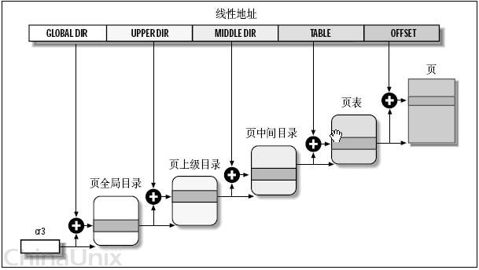
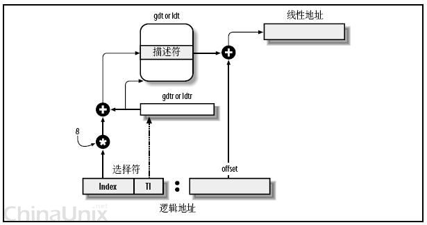

# 三个内存地址概念

* PA - physical address
> 指向真实物理内存中的位置
* VA - virtual address，也叫 linear address
> 能map为对应的PA（一般是一一对应，一般是通过页map，页偏移不变）
* LA - logical address
> 段号+段偏移 -> 段基址+段偏移


# 基本存储分配（管理）方式

* 连续
  * 单一连续
  * 固定分区
  * 动态分区
  * 可重定位分区 - 紧凑功能
* 离散
  * 页式
  * 段式
  * 段页式


# page 内存页技术
> 参见《[SS_存储管理之页式、段式、段页式存储](http://blog.csdn.net/wang379275614/article/details/13765599)》，《[SS_操作系统内存管理——分区、页式、段式管理](http://blog.csdn.net/hguisu/article/details/5713164)》

## 前置问题

1. 因为linux把虚拟内存的实现放在page技术，所以需要为每个进程维持一份页映射关系
2. 页的数量很多，如32位空间，4K一页的话，页有 2^20 个，也即4M个，那么需要4M个映射关系。 结合一，内存占用太多

## 对于页数量过多（尤其在虚拟地址场景）的问题
> 考虑到一个前提： 正常的进程使用的内存都是地址空间的一小部分，也即这么多（4M个）页的一小部分。 那么参考extFS的思路，可以`使用多级的方式来组织分页`。

具体思路见下文。

## 二级管理模式组织页单元


1. 每个活动进程，都有一个独立的虚拟内存空间，也对应了一个独立的页目录地址
2. cr3寄存器用来存放`页目录地址`，运行一个进程，需要把它的页目录地址放到cr3寄存器（在保存上下文的时候需要把前一个进程的该寄存器（以及其他信息）保存下来）
3. 把原来 页号:页偏移 的地址结构改为 面号:页号:页偏移（`directory:table:offset`，分别为10、10、12位）。 也即cr3指向的是`页目录的页目录`
4. 从cr3获取进程页目录地址后，根据地址的面号找到L2页目录，再根据页号找到页，然后翻译为对应物理页信息
5. 物理页+偏移量，得到真实物理地址

### 具体的map内容： page table entity - PTE
通过table:offset查找到的其实是PTE，要根据PTE得到真实页信息。 PTE结构如下：
`V:M:R:prot:page_frame_number == 1:1:1:2:20`

* V - valid bit
> 是否存在
* M - memory bit
> 是否脏页（modified）
* R - reference bit
> 是否被访问过（RW都算）
* prot - protection bits
> 是否可读/可写/可执行
* page_frame_number - 该页在内存中的物理位置

### TLB - translation lookaside buffer
CPU内的缓存，记录最近访问的页翻译结果。 只有当该cache miss才会实际让MMU去执行翻译。

### 优化点
前面说到，正常程序使用的页都是一小部分，那么可以认为L2页目录很多不需要存在，也即L1页目录的很多值为空 - 节约了大量空间。
可访问空间为： 2^10 * 2^10 * 2^12 = 2^32

### 疑问
这个是MMU的实现吗？MMU来维护（L1/L2）页表内容？
但是MMU自然不会知道进程的概念？ 更不会知道进程的页目录...（进程的页目录地址这个东西本身需要内核创建出来...）

## linux的页式内存管理 - 四层页管理架构


因为linux可能面对多CPU，有些可能是L3，甚至L4的内存页管理层次，所以linux为了抽象（为每个CPU提供统一的接口），提供了一个L4的管理架构。
* 页全局目录PGD - 对应二级的L1页表
* 页上级目录PUD
* 页中间目录PMD
* 页表PT - 对应二级的L2页表

同样的，地址的组成也随之变成五部分：`global_dir:upper_dir:middle_dir:table:offset`。
> 对于没有这么多层级的CPU,把对应部分的长度设为0即可（同时页表实现上也随之适应...）。

# segment 内存段技术
> 部分引用 [-第二月-的专栏 - “段寄存器”的故事](http://blog.csdn.net/michael2012zhao/article/details/5554023)
> 部分引用 [百度百科 - 段寄存器](http://baike.baidu.com/link?url=3bSgOKopDQHzfy1CWLPOoasH32zppEwoP5udWsW7kZc6ReYpd8rJ0rsGs7F0aGVEchtQMvHrGVhzZkZYQ2oN2a)

把内存分成段（segment）或者块（section），通过 segment号 + offset 来访问内存（内存地址可以求得段号+offset）。
也用于（链接时）对象文件。 `Segments or sections are also used in object files of compiled programs when they are linked together into a program image and when the image is loaded into memory.`

从下面可以看到： **段内存技术的主要目的是解决寻址空间不够的问题**

## 起源
8086的DB宽度是16位，而正如前面提到的，为了提升地址空间，AB宽度是20 （64K -> 1M）。带来了CPU多次寻址问题，为了解决该问题，引入了`内存分段技术/设计`。
要点如下：
1. 内存分为 2^(20-16) = 16个段
2. CPU发出的地址信号为16位
3. 每个段都有个段地址（段基址），其高16位存在对应段寄存器里（addr << 4）
> `#yonka# 这么说其实只要记录当前段就可以了？只需要高4位？`： 见下文
4. 寻址时不只使用地址本身，还使用对应的段寄存器，一起翻译得到物理地址。 此时地址其实是段内偏移地址，base + offset = actural addr。

`段寄存器segment register`。
设计了四个段寄存器：
* CS - 代码段
> 存放当前正在运行的程序代码所在段的段基址，表示当前使用的指令代码可以从该段寄存器指定的存储器段中取得，相应的偏移量则由IP提供。
>> IP: 作为指令寄存器，记录“下一条指令地址”，当然这里的含义是在该CS内的偏移地址
* DS - 数据段
> 指出当前程序使用的数据所存放段的最低地址，即存放数据段的段基址。
* ES - 其他
> 指出当前程序使用附加数据段的段基址，该段是串操作指令中目的串所在的段。
* SS - 堆栈
> 指出当前堆栈的底部地址，即存放堆栈段的段基址。

### 段基址、真实地址
前面提到，段寄存器也是16位，而段基址实际是20位，只保存其前16位到段寄存器。 同时段偏移地址也是16位，那么`段基址和段偏移地址其实有12bit的重叠，这部分是用偏移地址的`。

| Header One     | Header Two     | Header Two     | Header Two     |
| :------------- | :------------- | :------------- | :------------- |
| Base       |  b15 ~ b12      | b11 ~ b0       |        |
| Offset       |        |  o15 ~ 04      |  o3 ~ o0      |
| Address       |  a19 ~ a16      |  a15 ~ a4  | a3 ~ a0 |

## segment 和 虚拟内存
`segment id + offet -> 物理内存地址`
常用于实现虚拟内存
`虚拟内存地址 =MMU= -> segment id + offet -> 物理内存地址`
> 这种情况下，每个段会有一个flag表示是否在内存中，如果不在的话会触发异常，而OS对该异常的处理方式是： 读取该段数据到内存

## 限制
* 进程只能访问有权限（访问）的段
* offset要在段长度范围内

> 否则： segment fault


# segment

## segment分类

* user segment
	* code segment
	* data segment
* system segment
	* LDT segment
	* TSS segment

## segment vs page
```
Segmentation vs. Paging
Ever wonder what the terms segmentation and paging refer to? or heck, what is the difference between the two? Well you're not alone, many people out there are confused when it comes to these terms...

Let’s start by making sure we have a clear understanding about what exactly Paging and Segmentation is. We have tried to simplify this in a way which would be the easiest to understand.

Paging – Computer memory is divided into small partitions that are all the same size and referred to as, page frames. Then when a process is loaded it gets divided into pages which are the same size as those previous frames. The process pages are then loaded into the frames.

Segmentation – Computer memory is allocated in various sizes (segments) depending on the need for address space by the process. These segments may be individually protected or shared between processes. Commonly you will see what are called “Segmentation Faults” in programs, this is because the data that’s is about to be read or written is outside the permitted address space of that process.

So now we can distinguish the differences and look at a comparison between the two:

Paging:
Transparent to programmer (system allocates memory)
No separate protection
No separate compiling
No shared code

Segmentation:
Involves programmer (allocates memory to specific function inside code)
Separate compiling
Separate protection
Share code
```

## GDT/LDT
> 主要来自 [内核中的三个地址理解](http://blog.chinaunix.net/uid-26421509-id-3907980.html)


Intel设计的本意是，一些`全局的段描述符，就放在“全局段描述符表(GDT)”中`，一些`局部的，例如每个进程自己的，就放在所谓的“局部段描述符表(LDT)”中`。那究竟什么时候该用GDT，什么时候该用LDT呢？这是由`段选择符中的T1字段表示的，=0，表示用GDT，=1表示用LDT`。

GDT在内存中的地址和大小存放在CPU的`gdtr控制寄存器`中，而LDT则在`ldtr寄存器`中。

好多概念，像绕口令一样。这张图看起来要直观些：


首先，给定一个完整的逻辑地址[段选择符：段内偏移地址]，
1. 看段选择符的T1=0还是1，知道当前要转换是GDT中的段，还是LDT中的段，再根据相应寄存器，得到其地址和大小。我们就有了一个数组了。
2. 拿出段选择符中前13位，可以在这个数组中，查找到对应的段描述符，这样，它了Base，即基地址就知道了。
3. 把Base + offset，就是要转换的线性地址了。

> `#yonka#` 所以可以通过该SR的TI字段来指示当前应该使用哪个GT（也即访问该进程的GT），`但是否有必要则是另一回事了，因为引入page内存管理后，虚拟内存可以通过该技术来实现，同时因为DB宽度足够，也不需要段技术来扩大寻址空间，so...`

## segment selector, segment descriptor, segment register

### segment selector 段选择符
存在对应的`segment register` - `段寄存器`中，表示当前代码/数据/...的段（可以理解为段号）。
结构如下：

* 索引号 - 可以看做段号，作为index可以访问对应的segment descriptor
* TI - 指示用GDT还是LGT
* RPL - 请求者特权级

#### 如何访问对应的段描述符
1. 根据TI确定是GDT还是LGT
2. 根据1去对应的寄存器（gdtr或ldtr）拿GDT/LDT的地址（内存）
3. 根据2以及索引号拿段描述符数据

### segment register 段寄存器
根据...的不同，有代码段寄存器、数据段寄存器等等。 记录对应的...的当前段信息。

#### user segment register
* code segment register
	* CS
* data segment register
	* ES
	* SS
	* DS
	* FS
	* GS


### segment descriptor 段描述符
记录各个段的信息，如主要的段基址等。 不同类型的段的段描述符的字段可能有差异。
如下：


#### DPL
可以看到在段描述符中还有一个 DPL 字段，该字段表示该段要求的特权级别。 只有当实际有效特权级别达到该级别时才能访问。
> 实际是要求： MAX(CPL, RPL) >= DPL

#### S/TYPE
S位表示SD的类型：
* 1 - 数据段和代码段描述符
* 0 - 系统段描述符和门描述符

对于数据段和代码段描述符（S == 1），TYPE的四个二进制位为：

| 位 | 功能     | 含义  |
| :------------- | :------------- | :------------- |
| 3       | 执行位       | 置1时表示可执行，置0时表示不可执行 |
| 2       | 一致位       | 置1时表示一致码段，置0时表示非一致码段 |
| 1       | 读写位       | 置1时表示可写，置0时表示只读 |
| 0       | 访问位       | 置1时表示已访问，置0时表示未访问 |

> 注意这里的2-一致位： 引入了`一致性代码和非一致性代码`的概念，见下文

## CPL, DPL, RPL
> PL是`越小级别越高`

* CPL - current privilege level
> 当前（代码段的）PL，CS的低2位
* DPL - descriptor ...
> 上文已有介绍
* RPL - requested ...
> 当前请求（者）的PL，DS

因为有用户代码调内核代码访问目标段的情况，正常情况下应该是访问合法段（也即DPL>=CPL的段），而如果没有RPL的话，指令执行到内核代码时，CPL变高，这时候就可以访问高级别段了。
加上RPL时，则相当于`请注意此人地位`，就不会...了。
> 这个前提基于`执行代码改变时RPL不变`

## 一致性代码/非一致性代码
http://xu3stones.blog.163.com/blog/static/2059571362012103094448554/
http://blog.csdn.net/better0332/article/details/3416749
从上文可以看到，代码和数据段描述符中有一致位。 引入的原因：
> 前文提到可以通过 MAX(CPL, RPL) 来“限制执行到高权限代码段的请求者的权限”，但`哪些高权限代码可以被低权限请求者执行`这个本身也是一个问题： `通过一致性和段类型来分别定义权限检查方式`。

| 一致性、代码类型               |  特权级（低->高）    | 特权级（高->低）     | 相同特权级     |
| :------------- | :------------- | :------------- | :------------- |
| 一致代码段       | Yes       |  No      |  Yes      |
| 非一致代码段       | No       | No       |  Yes      |
| 数据段       | No       | Yes       | Yes       |

简而言之，对于特权级不一样的情况：
* 只有一致性代码段才能实现特权级越级访问
> 一般是内核共享出来给应用程序调用的代码
* 只有数据段才能实现特权级降级访问
> 限制降级访问代码段是合理的，“避免被坑”。 而允许降级访问数据段也是必须的

> 这里的“允许”是指绝对情况，“允许”但“能不能”还要看方式/条件是否符合要求

# 代码间跳转

## 普通跳转（直接跳转）
没有经过gate，方式是 JMP和CALL。 带全地址（配合SS，SS指向目的代码段)。
`这种方式不能引起CPL变化，也即不能是PL发生跃迁`

### 鉴权方式
* dst是一致代码段
> 要求： CPL >= DPL，不检查RPL
> 跳转后： CPL不变
* dst是非一致代码段
> 要求： CPL == DPL && RPL <= DPL
> 跳转后： CPL不变

## TODO

# descriptor 描述符
> 主要来自[mouseos - segment descriptor 结构](http://www.mouseos.com/arch/descriptor.html)

x86体系下一共8种。 保存在对应的DT（描述符表）中。

**从描述对象分类**
> 只是类别，不是具体的descriptor

* segment descriptor
* gate descriptor

结合segment和gate节提到的分类，可以得到：
* segment descriptor
	* code segment descriptor
	* data SD
	* LDT SD
	* TSS SD
* gate descriptor
	* call gate descriptor
	* trap GD
	* interrupt GD
	* task GD

**从级别来分**
> 门描述符和系统段描述符都属于系统级别； 只有用户段描述符才属于用户级别

* system descriptor
	* LDT SD
	* TSS SD
	* call GD
	* trap GD
	* interrupt GD
	* task GD
* user descriptor
	* code SD
	* data SD

## descriptor table - DT - 描述符表
descriptor 分别保存在 3 个表中：
* GDT（Global Descriptor Table）
* LDT（local Descriptor Table）
* IDT（Interupt Descriptor Table）

### 每个DT存放的描述符
* GDT 表可以存放：
	* code segment descriptor
	* data segment descriptor
	* LDT descriptor - `只能GDT`
	* TSS descriptor - `只能GDT`
	* call gate descriptor
	* task gate descriptor
* LDT 表可以存放：
	* code segment descriptor
	* data segment descriptor
	* call gate descriptor
	* task gate descriptor
* IDT 表可以存放：
	* interrupt gate descriptor - `只能IDT`
	* trap gate descriptor - `只能IDT`
	* task gate descriptor - `只能IDT`

在 processor 的当前运行状态下，只能有 1 个 GDT 表, LDT 表以及 IDT 表。
`#yonka#` GDT, IDT 都只有一个，这里的意思应该是LDT同一时刻只有一个
但是可以构建多个 LDT 表环境，通过不断切换加载 LDT segment 从而实现系统的多 LDT 表运行环境。

# gate 门
**门（call、中断、task、trap等）**： 用来控制`跨段的执行`。 **不同的目标类型和指令 应用的 PL检查是不同的**。

## gate分类

* call gate
* task gate
* interrupt gate
* trap gate

## call gate 门调用（或者叫 调用门 会更好一些）
**目的**： 改变进程的PL（主要是`让低PL的代码能调用高PL的代码`： 常见于现代操作系统，`要让用户程序使用内核函数以及以OS能控制的方式进行syscall`）

**演进**： 逐渐被启用，取而代之的SYSENTER/SYSEXIT更快一些

### 使用方式： 通过 CALL FAR 指令执行一个预定义的函数 （CALL, JMP）
1. set up a call gate
> kernel自己设置，或者用户代码调kernel函数来设置（如果有的话，也许是不公开API）
2. 执行CALL FAR指令
> 该指令会： 
> 1. 取段selector定位到GDT（LDT？）中的call gate；
> 2. 根据call gate获取dst code segment
> 3. 在GDT（LDT？）找到该段的描述符，取到dst segment base
> 4. dst segment base + offset from call gate 得到地址（dst segment descriptor的selector部分会被load到CSR）

注意到：
* 做CALL FAR的时候，offset其实是没有被使用的（被忽略），真实的段、段偏移都是由call gate给出


## interrupt gate & trap gate & task gate
都在IDT中，工作方式和call gate一样，参数不同。
interrupt gate会清空EFLAGS的IF bit，而trap gate不会。 这使得前者适合于处理硬件中断，而后者则用于硬件辅助的虚拟化。

## interrupt/trap gate 中断/陷阱门
interrupt gate 与 trap gate 除了 descriptor type （前者0xE，后者0xF）不同外，其它是完全一样的，它们的区别于：
* 使用 interrupt gate 调用 interrupt handler 时，processor 将清 FLAGS.IF 标志：FLAGS.IF = 0 （屏蔽硬件中断）
*　使用 trap gate 调用 interrupt handler 时，不影响 FLAGS.IF 标志。

从下图可以看到：
IG/TPG以IDT条目形式存在，CPU根据中断向量（号）算得具体的IG/TPG然后跳转至，然后从IG/TPG中获取dest segment和offset，又从GDT中查得dest segment descriptor取出其中的（dest）segment base，该base+前面得到的offset即为handler（线性）地址。


对于提供给用户使用转入内核服务例程的 handler 应该使用 DPL = 3 权限，通常 OS 会提供一个转入内核服务的接口：
* windows 下的 0x2E 中断例程
* linux 下的 0x80 中断例程

它们只是一个接口，这些的 interrupt gate 的 DPL = 3，是为用户提供使用系统服务的一个接口。

### IDT： interruption descriptor table 中断描述符表
是IA-32架构特有的； 是实模式中的中断向量表（interrupt vector table - IVT）在保护模式中的副本（IVT告知ISR（interrupt service routines中断服务程序）在哪）；
详见 “# IDT”


## task gate 任务门（= =）


从图可以看到，使用TKG做任务切换的过程比前几种GD要复杂一些。
* 最后需要跳转的地址的段和段偏移来自 TSS segment
* TSS segment的段base来自TR寄存器（TR.Base）
* TR寄存器的内容来自TSS descriptor
* TSS descriptor则是通过TKG描述符里的selector
* TKG描述符肯定是通过TKG selector在GDT里查到了


## legacy mode 和 long mode
... TODO

# 段页式内存管理
```
现代操作系统的发展要求CPU支持页式存储管理。

页式存管本身是与段式存管分立的，两者没有什么关系。但对于Intel来说，同样是由于“段寄存器”这个历史的原因，它必须把页式存管建立在段式存管的基础之上，尽管这从设计的角度来说这是没有道理，也根本没有必要的。

在段式存管中，由程序发出的变量地址经映射（段基址+段内偏移）之后，得到的32位地址就是一个物理地址，是可以直接放到地址总线是去取数的。

在页式存管中，过程也是相似的，由程序发出的变量地址并不是实际的物理地址，而是一个三层的索引结构，这个地址经过一系统的映射之后才可以得到物理地址。

现在对于Intel CPU来说，以上两个映射过程就要先后各做一次。由程序发出的变量地址称为“逻辑地址”，先经过段式映射成为“线性地址”，线性地址再做为页式映射的输入，最后得到“物理地址”。

Linux内核实现了页式存储管理，而且并没有因为两层存管的映射而变得更复杂。Linux更关注页式内存管理，对于段式映射，采用了特殊的方式把它简化。让每个段寄存器都指向同一个段描述项，即只设了一个段，而这个段的基地址为0，段长度设为最大值4G，这个段就与整个物理内存相重合，逻辑地址经映射之后就与线性地址相同，从而把段式存管变成“透明”的。
```
> 来自 [“段寄存器”的故事](http://blog.csdn.net/michael2012zhao/article/details/5554023)

## “段”的保留
因为`段寄存器`这个历史包袱，需要把页管理方式建立在段管理之上。
详见下文。

## linux对“段”的”规避
> 来自 [内核中的三个地址理解](http://blog.chinaunix.net/uid-26421509-id-3907980.html)

Intel要求两次转换，这样虽说是兼容了，但是却是很冗余，呵呵，没办法，硬件要求这样做了，软件就只能照办，怎么着也得形式主义一样。
另一方面，其它某些硬件平台，没有二次转换的概念，Linux也需要提供一个高层抽像，来提供一个统一的界面。所以，Linux的段式管理，事实上只是“哄骗”了一下硬件而已。

按照Intel的本意，全局的用GDT，每个进程自己的用LDT——不过Linux则对所有的进程都使用了相同的段来对指令和数据寻址。即用户数据段，用户代码段，对应的，内核中的是内核数据段和内核代码段。这样做没有什么奇怪的，本来就是走形式嘛，像我们写年终总结一样。
```c
include/asm-i386/segment.h
#define GDT_ENTRY_DEFAULT_USER_CS        14
#define __USER_CS (GDT_ENTRY_DEFAULT_USER_CS * 8 + 3)

#define GDT_ENTRY_DEFAULT_USER_DS        15
#define __USER_DS (GDT_ENTRY_DEFAULT_USER_DS * 8 + 3)

#define GDT_ENTRY_KERNEL_BASE        12

#define GDT_ENTRY_KERNEL_CS                (GDT_ENTRY_KERNEL_BASE + 0)
#define __KERNEL_CS (GDT_ENTRY_KERNEL_CS * 8)

#define GDT_ENTRY_KERNEL_DS                (GDT_ENTRY_KERNEL_BASE + 1)
#define __KERNEL_DS (GDT_ENTRY_KERNEL_DS * 8)
```

把其中的宏替换成数值，则为：
```c
#define __USER_CS 115        [00000000 1110  0  11]
#define __USER_DS 123        [00000000 1111  0  11]
#define __KERNEL_CS 96      [00000000 1100  0  00]
#define __KERNEL_DS 104    [00000000 1101  0  00]
```


方括号后是这四个段选择符的16位二制表示，它们的索引号和T1字段值也可以算出来了
```c
__USER_CS              index= 14   T1=0
__USER_DS               index= 15   T1=0
__KERNEL_CS           index=  12  T1=0
__KERNEL_DS           index= 13   T1=0
```


T1均为0，则表示都使用了GDT，再来看初始化GDT的内容中相应的12-15项(arch/i386/head.S)：
```c
        .quad 0x00cf9a000000ffff        /* 0x60 kernel 4GB code at 0x00000000 */
        .quad 0x00cf92000000ffff        /* 0x68 kernel 4GB data at 0x00000000 */
        .quad 0x00cffa000000ffff        /* 0x73 user 4GB code at 0x00000000 */
        .quad 0x00cff2000000ffff        /* 0x7b user 4GB data at 0x00000000 */
```


按照前面段描述符表中的描述，可以把它们展开，发现其16-31位全为0，即四个段的基地址全为0。

这样，给定一个段内偏移地址，按照前面转换公式，0 + 段内偏移，转换为线性地址，可以得出重要的结论，“在Linux下，逻辑地址与线性地址总是一致（是一致，不是有些人说的相同）的，即逻辑地址的偏移量字段的值与线性地址的值总是相同的。！！！”

忽略了太多的细节，例如段的权限检查。呵呵。

Linux中，绝大部份进程并不例用LDT，除非使用Wine ，仿真Windows程序的时候。

> `#yonka#` 也即：
* linux下逻辑地址和虚拟地址（线性地址）一样
* linux下靠页内存技术来实现虚拟内存
* linux可以认为不使用段，更别说LDT了

# ring, CPU 用户模式/特权模式

## ring介绍

* 来源： intel的CPU设计
* 目的： 实现`特权代码` - 保护`资源`
> 普通的程序和特殊的程序（驱动、内核等）运行在不同的RING，分别能执行不同的代码/指令，访问不同的内存区域
* 细节
> Intel的x86处理器是通过Ring级别来进行访问控制的，级别共分4层，RING0,RING1,RING2,RING3。
**Windows只使用其中的两个级别RING0和RING3**。RING0层拥有最高的权限，RING3层拥有最低的权限。
按照**Intel原有的构想，应用程序工作在RING3层，只能访问RING3层的数据，操作系统工作在RING0层，可以访问所有层的数据，而其他驱动程序位于RING1、RING2层**，每一层只能访问本层以及权限更低层的数据。
如果普通应用程序企图执行RING0指令，则Windows会显示“非法指令”错误信息。

## 细节问题

### 具体ring限制了哪些？
* About 15 machine instructions, out of dozens, are restricted by the CPU to ring zero. 部分CPU指令只允许ring0执行
> An attempt to run them outside of ring zero causes a general-protection exception, like when a program uses invalid memory addresses. 非法访问会引起异常
* access to memory and I/O ports is restricted based on privilege level. 对内存和外设的访问也有ring的限制
> MMU做地址翻译的时候会用到ring，对于linux，非ring0无法访问内核地址空间（数据段、代码段）
> 所有的用户代码都运行在ring3，而内核/驱动代码运行在ring0

### ring信息存在哪？
一般是某个寄存器的特殊位
> 意味着该寄存器不是`想改就能改`的

具体的说是CS（segment selector，有 CSS和DSS分别对应code和data）的0-1bit： **CPL（current privilege level）**

### 什么时候能改变ring信息呢？ 谁能改变呢？
```
Note that, in protected mode, code may always modify all segment registers except CS (the code segment selector). This is because the current privilege level (CPL) of the processor is stored in the lower 2 bits of the CS register. The only way to raise the processor privilege level (and reload CS) is through the lcall (far call) and int (interrupt) instructions. Similarly, the only way to lower the privilege level (and reload CS) is through lret (far return) and iret (interrupt return) instructions. In real mode, code may also modify the CS register by making a far jump (or using an undocumented POP CS instruction on the 8086 or 8088)[4]). Of course, in real mode, there are no privilege levels; all programs have absolute unchecked access to all of memory and all CPU instructions.
```
> from wikipedia [X86_memory_segmentation](https://en.wikipedia.org/wiki/X86_memory_segmentation)

* 权级只对保护模式有意义，实模式没有权级，程序可以完全访问内存和指令
* 直接访问CS并不能改变CPL
* 只有两种方式能提权： lcall、int； 对应的只有两种方式能降权： lret、iret

### CPU模式 跟 系统用户角色有关系吗？
**没关系**
那是OS application level的限制，也是root可以执行能达到...的程序，但是与CPU无关。
