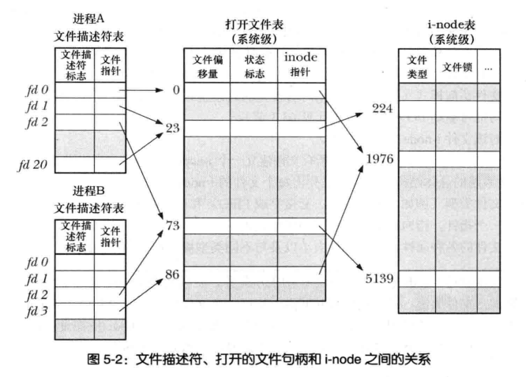

<!-- TOC depthFrom:1 depthTo:6 withLinks:1 updateOnSave:0 orderedList:0 -->

- [fd和linux中文件相关的数据结构](#fd和linux中文件相关的数据结构)
	- [内核维护的三个数据结构](#内核维护的三个数据结构)
		- [file description（fdnt中的）中的信息](#file-descriptionfdnt中的中的信息)
		- [file descriptor table 和 file description table](#file-descriptor-table-和-file-description-table)
		- [inode表中信息](#inode表中信息)
	- [复制fd](#复制fd)
- [io优化点： 分散输入（readv）和集中输出（writev）](#io优化点-分散输入readv和集中输出writev)
	- [glibc对readv/writev的（优化）封装](#glibc对readvwritev的优化封装)
	- [preadv/pwritev](#preadvpwritev)

<!-- /TOC -->


# fd和linux中文件相关的数据结构

## 内核维护的三个数据结构
* 进程级的文件描述符表 - file descriptor table
* 系统级的打开文件表（文件描述表） - open file table/file description table
* 文件系统的inode表

**file descriptor 和  file description的关系**
> 后者包含文件相关信息（#yonka# 应该是*FILE吧），而前者只是进程对这个文件的“持有证明”（实现上是个int）
> file description 也叫 open file handle（打开文件句柄）
> 下面用`fd表示file descriptor`； 用`fdn表示file description`

### file description（fdnt中的）中的信息
* 当前文件偏移量 - 调用read/write时更新，或者用lseek直接修改
* 打开文件时锁使用的状态标识（flags参数中的部分）
* 文件访问模式（flags中的部分，O_RDWR/O_RDONLY/O_WRONLY这几个）
* 信号驱动IO相关的设置
* 对该文件inode对象的引用

### file descriptor table 和 file description table

从图里可以看到：
* fdt不只是fd到\*FILE的映射，还多了fd flag（目前只有close-on-exec）。
* 可以理解dup只是在fdt中新加了一个条目，用新的fd指向同样的（fdnt中的）\*FILE
* fdt也叫open file descriptor table，是进程级别的； 而fdnt是系统（内核）级别的
* 多个fdn可以指向同一个inode，也即同一个文件可以多次（被同一个进程或者不同进程）打开

**引申**
* 指向同一个fdn的多个fd共享offset等信息，所以会互相影响（修改会互相观察到），无论同一个进程还是多个进程（常见于父子进程）； 而close-on-exec等则私有，修改也互不影响


### inode表中信息
* 文件类型（常规、套接字、FIFO等）和访问权限
* 指向文件所持有的锁的列表的指针
* 文件属性（大小、各种时间戳等）

> 注意以上是系统级（内存中）inode表中inode信息里与磁盘inode相同的部分，以下是额外信息：
>> #yonka# 但按这个说法，第二个指向锁的指针也是磁盘inode没有的啊... 囧

* 引用该inode的打开文件句柄数量
* 该inode所在设备的主、从设备号
* 一些打开文件时与文件相关的临时属性（如文件锁等）

## 复制fd

方式如下，详见manual：
* dup
> `int dup(int oldfd)`
* dup2
> `int dup2(int oldfd, int newfd)`
* dup3
> `int dup(int oldfd, int newfd, int flags)`
> 可以在dup时进行一些flag修改，但目前只支持close-on-exec（fd私有的）
* fcntl
> `newfd = fcntl(oldfd, F_DUPFD, startfd)`，errno和dup系列有些差别


# io优化点： 分散输入（readv）和集中输出（writev）
思路： 多份（不连续）buf中内容一次性write/一次性read数据到多份（不连续）buf，减少系统调用次数，同时也可能减少执行IO次数

```c
#include <sys/uio.h>
ssize_t readv(int fd, const struct iovec *iov, int iovcnt);
ssize_t writev(int fd, const struct iovec *iov, int iovcnt);
// iovcnt表示数量。 SUSv3允许系统提供限制： <limits.h>中的IOV_MAX，并且要求不小于16，linux为1024（对应内核常量 UIO_MAXIOV）

struct iovec {
  void *iov_base;  // buf位置
  size_t iov_len;  // buf长度
};
```

## glibc对readv/writev的（优化）封装
兼容了iovcnt过大的情况，创建一块能容纳所有iovecs锁描述的buf的临时buf...（#yonka# 似乎不是什么好主意 = =）

## preadv/pwritev
顾名思义...
