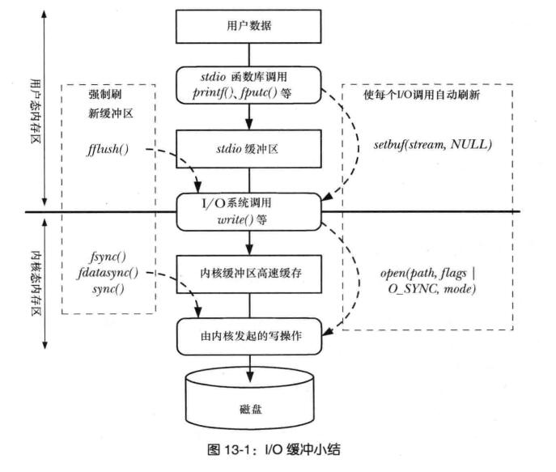

<!-- TOC depthFrom:1 depthTo:6 withLinks:1 updateOnSave:0 orderedList:0 -->

- [linux cached memory导致内存不足](#linux-cached-memory导致内存不足)
	- [问题： cached mem应该是可回收分配的，为什么会导致程序运行失败呢？](#问题-cached-mem应该是可回收分配的为什么会导致程序运行失败呢)
	- [分析](#分析)
	- [如何清掉cached memory](#如何清掉cached-memory)
- [linux CPU iowait 的真实含义](#linux-cpu-iowait-的真实含义)
	- [ref: The precise meaning of I/O wait time in Linux](#ref-the-precise-meaning-of-io-wait-time-in-linux)
	- [ref: What exactly is "iowait"?](#ref-what-exactly-is-iowait)
	- [ref: [iowait-wa-vmstat](http://www.oenhan.com/iowait-wa-vmstat)]
- [几种会使得进程有效虚拟地址（有对应页表映射）范围发生变化的场景](#几种会使得进程有效虚拟地址有对应页表映射范围发生变化的场景)
- [栈内存分配和释放](#栈内存分配和释放)
- [malloc函数族 和 brk/sbrk的关系](#malloc函数族-和-brksbrk的关系)
	- [brk/sbrk](#brksbrk)
	- [malloc函数族](#malloc函数族)
		- [free函数](#free函数)
- [I/O缓冲小结](#io缓冲小结)
	- [stdio 缓冲](#stdio-缓冲)
		- [设置文件流的缓冲 - setvbuf/setbuf](#设置文件流的缓冲-setvbufsetbuf)
			- [setvbuf](#setvbuf)
			- [setbuf](#setbuf)
			- [setbuffer](#setbuffer)
		- [buf模式](#buf模式)
		- [刷新缓冲 - fflush](#刷新缓冲-fflush)
			- [C99对一个流同时用于输入和输出的刷新缓冲要求](#c99对一个流同时用于输入和输出的刷新缓冲要求)
	- [OS/kernel 缓冲](#oskernel-缓冲)
	- [磁盘高速缓冲](#磁盘高速缓冲)
- [向内核“建议”IO模式](#向内核建议io模式)
	- [posix_fadvise](#posixfadvise)
	- [advice](#advice)
- [“直接”IO - O_DIRECT](#直接io-odirect)
	- [限制](#限制)

<!-- /TOC -->

# linux cached memory导致内存不足
背景：
> 同时四个解压的job在跑，tar解压，每个压缩包大约是100G，全是图片（压缩包很大、解压出问题很多）

内存使用情况如下：
```shell
$ free -m
              total        used        free      shared     buff    cache
Mem:           3965        3926          39          16      103     3369
-/+ buffers/cache:          454        3511
Swap:          5090           0        5090

root@bvc-log-01:/data/app/php/daddy # cat /proc/meminfo
MemTotal:        4060900 kB
MemFree:           39612 kB
MemAvailable:    3798788 kB
Buffers:          105516 kB
Cached:          3448712 kB
SwapCached:            0 kB
Active:           913864 kB
Inactive:        2781576 kB
Active(anon):      13220 kB
Inactive(anon):   144880 kB
Active(file):     900644 kB
Inactive(file):  2636696 kB
Unevictable:           0 kB
Mlocked:               0 kB
SwapTotal:       5213180 kB
SwapFree:        5213180 kB
Dirty:                 0 kB
Writeback:             0 kB
AnonPages:        141204 kB
Mapped:            22732 kB
Shmem:             16896 kB
Slab:             265036 kB
SReclaimable:     251992 kB
SUnreclaim:        13044 kB
KernelStack:        2048 kB
PageTables:         4736 kB
NFS_Unstable:          0 kB
Bounce:                0 kB
WritebackTmp:          0 kB
CommitLimit:     7243628 kB
Committed_AS:     472392 kB
VmallocTotal:   34359738367 kB
VmallocUsed:       23888 kB
VmallocChunk:   34359709696 kB
HardwareCorrupted:     0 kB
AnonHugePages:         0 kB
HugePages_Total:       0
HugePages_Free:        0
HugePages_Rsvd:        0
HugePages_Surp:        0
Hugepagesize:       2048 kB
DirectMap4k:      329600 kB
DirectMap2M:     3864576 kB
DirectMap1G:     2097152 kB
```
同时top观察到各进程并没有明显使用较多内存的。

执行脚本时提示：
```
Fatal error: Allowed memory size of 2097152 bytes exhausted (tried to allocate 528384 bytes) in /data/app/php/daddy/cli.php on line 43
```

## 问题： cached mem应该是可回收分配的，为什么会导致程序运行失败呢？
... 暂时未知...

## 分析
1. 大量IO尤其是多文件，cache暴涨可以理解
2. 但不能分配内存这个太奇怪。 网上有说法是可能slab里dentry多多。但看了下原机器上slab也就两百多兆。
```
# 样例，不是原服务器数据
Active / Total Objects (% used)    : 578623 / 608765 (95.0%)
Active / Total Slabs (% used)      : 6907 / 6907 (100.0%)
Active / Total Caches (% used)     : 65 / 90 (72.2%)
Active / Total Size (% used)       : 52304.19K / 60201.99K (86.9%)
Minimum / Average / Maximum Object : 0.01K / 0.10K / 8.00K

 OBJS ACTIVE  USE OBJ SIZE  SLABS OBJ/SLAB CACHE SIZE NAME                   
13365  12093  90%    0.58K    243       55      7776K inode_cache
29022  19158  66%    0.19K    691       42      5528K dentry
 4608   2726  59%    1.00K    144       32      4608K xfs_inode
123136 123136 100%    0.03K    962      128      3848K kmalloc-32
58496  51594  88%    0.06K    914       64      3656K kmalloc-64
 6328   3734  59%    0.57K    113       56      3616K radix_tree_node
122570 122570 100%    0.02K    721      170      2884K fsnotify_event_holder
25488  25488 100%    0.11K    708       36      2832K sysfs_dir_cache
 1072   1019  95%    2.00K     67       16      2144K kmalloc-2048
 2891   2711  93%    0.64K     59       49      1888K proc_inode_cache
 1856   1801  97%    1.00K     58       32      1856K kmalloc-1024
23256  18435  79%    0.08K    456       51      1824K selinux_inode_security
 3136   3055  97%    0.50K     98       32      1568K kmalloc-512
 6253   6253 100%    0.21K    169       37      1352K vm_area_struct
  462    424  91%    2.84K     42       11      1344K task_struct
  312    275  88%    4.00K     39        8      1248K kmalloc-4096
 5040   5040 100%    0.19K    120       42       960K kmalloc-192
 3776   3043  80%    0.25K    118       32       944K kmalloc-256
  405    405 100%    2.06K     27       15       864K sighand_cache
53248  53248 100%    0.02K    208      256       832K kmalloc-16
 1104   1104 100%    0.66K     23       48       736K shmem_inode_cache
  588    588 100%    1.12K     21       28       672K signal_cache
85504  85504 100%    0.01K    167      512       668K kmalloc-8
 1722   1019  59%    0.38K     41       42       656K blkdev_requests
  780    780 100%    0.81K     20       39       640K task_xstate
 3975   3444  86%    0.15K     75       53       600K xfs_ili
 6776   6776 100%    0.07K    121       56       484K Acpi-ParseExt
  210    210 100%    2.06K     14       15       448K idr_layer_cache
 4452   4452 100%    0.09K    106       42       424K kmalloc-96
   48     48 100%    8.00K     12        4       384K kmalloc-8192
 2272   2070  91%    0.12K     71       32       284K kmalloc-128
  408    408 100%    0.62K      8       51       256K sock_inode_cache
  272    272 100%    0.94K      8       34       256K RAW
 3904   3904 100%    0.06K     61       64       244K anon_vma
  140    140 100%    1.56K      7       20       224K mm_struct
 4896   4896 100%    0.04K     48      102       192K Acpi-Namespace
  255    255 100%    0.62K      5       51       160K files_cache
   80     80 100%    1.97K      5       16       160K blkdev_queue
  156    156 100%    0.81K      4       39       128K bdev_cache
   68     68 100%    1.88K      4       17       128K TCP
  128    128 100%    1.00K      4       32       128K UDP
   64     64 100%    2.00K      4       16       128K TCPv6
  112    112 100%    1.12K      4       28       128K UDPv6
 2380   2380 100%    0.05K     28       85       112K shared_policy_node
  200    200 100%    0.39K      5       40        80K xfs_efd_item
  196    196 100%    0.32K      4       49        64K taskstats
  106    106 100%    0.59K      2       53        64K hugetlbfs_inode_cache
  280    280 100%    0.23K      8       35        64K cfq_queue
  144    144 100%    0.44K      4       36        64K scsi_cmd_cache
  132    132 100%    0.48K      4       33        64K xfs_da_state
  585    391  66%    0.10K     15       39        60K buffer_head
  192    192 100%    0.25K      6       32        48K kmem_cache
  124    124 100%    0.26K      2       62        32K numa_policy
  204    204 100%    0.16K      4       51        32K sigqueue
  128    128 100%    0.25K      4       32        32K tw_sock_TCP
   56     56 100%    0.56K      1       56        32K kioctx
   36     36 100%    0.88K      1       36        32K mqueue_inode_cache
```
3. 网上有建议说采用其他方式绕开buf/cache的。 如： `dd if=srcfile bs=1M iflag=direct | tar zxf -`
```
Your image shows quite the contrary, actually.

As you can see under the RES column, tar memory consumption is quite low. You RAM usage appear to increase simply because Linux is actively caching the data read by the tar command. This, in turn, causes memory pressure and dirty page writeback (basically, the system flush its write cache to accommodate for the greater read-caching required) and, possibly, useful data are evicted from the I/O cache.

Unfortunately, it seems that tar itself can not be instructed to use O_DIRECT or POSIX_FADVISE (both of which can be used to "bypass" the cache). So, using tar there is not a real solution out here...

Unfortunately, only some tools support direct I/O operations. The most common tool is dd, and you can use it to compress a file using something as dd if=srcfile bs=1M iflag=direct | bzip2 newfile.bz2. However, this clearly is a no match for a full directory tree tar
```

## 如何清掉cached memory
观察到程序退出后，cached memory仍然保持一段时间。清理方式为： `sync; echo 3 > /proc/sys/vm/drop_caches`。
实际使用中观察到无论（带来cache的）程序执行中还是退出后，`sync`执行似乎都没什么效果，而`echo 3 > /proc/sys/vm/drop_caches`效果明显，如下：
```shell
$ free -m && echo 3 > /proc/sys/vm/drop_caches && free -m && sleep 1 && free -m
              total        used        free      shared  buff/cache   available
Mem:           1833         299          66          19        1468        1341
Swap:          2047           0        2047
              total        used        free      shared  buff/cache   available
Mem:           1833         299        1079          19         455        1356
Swap:          2047           0        2047
              total        used        free      shared  buff/cache   available
Mem:           1833         299          81          19        1452        1341
Swap:          2047           0        2047
```

可以通过cronjob执行以下脚本的方式来定期清理掉cache mem：
```shell
# Therefore, you can run the following every hour in a cron job:
sync ; echo 3 > /proc/sys/vm/drop_caches
sync ; echo 0 > /proc/sys/vm/drop_caches
```


# linux CPU iowait 的真实含义
从下面的ref`The precise meaning of I/O wait time in Linux`可以知道：
* wait for io的是task而不是CPU
* 对于单任务系统（单核），io wait确实可以看成CPU idle time的一部分，因为此时只能idle
> ref里是说`单核`，但单核不代表io wait时就是CPU idle，因为内核可以调度去做其他事
* 对于有内核调度任务的多任务系统，CPU idle的情况只能是： 调度在该CPU上执行task block了但又没有调度其他task执行（在该CPU）时
> 注意这里的block还不是block在syscall层面，而是CPU层面block，一般是外部IO等待。

而从下面的ref`What exactly is "iowait"?`可以知道：
* 持续的io-block一般不会明显增加io-wait，因为肯定会被调度出去执行其他task。 与此相反，io-wait更与“wait”的频繁程度正相关
* 由于一些内核调度算法会增加io-bounding的task的优先级，使得“频繁IO”的task会带来更明显的“io-wait”
* io-wait一定程度上是io-bound task在task（还有cpu-bound）中的比例。强CPU-bould的task会使得内核做io-schedule的频率降低（而该操作会增加iowait记数）

## ref: The precise meaning of I/O wait time in Linux
```
The precise meaning of I/O wait time in Linux
Linux
November 18, 2013 (updated March 3, 2015)
Some time ago I had a discussion with some systems guys about the exact meaning of the I/O wait time which is displayed by top as a percentage of total CPU time. Their answer was that it is the time spent by the CPU(s) while waiting for outstanding I/O operations to complete. Indeed, the man page for the top command defines this as the “time waiting for I/O completion”.

However, this definition is obviously not correct (or at least not complete), because a CPU never spends clock cycles waiting for an I/O operation to complete. Instead, if a task running on a given CPU blocks on a synchronous I/O operation, the kernel will suspend that task and allow other tasks to be scheduled on that CPU.

So what is the exact definition then? There is an interesting Server Fault question that discussed this. Somebody came up with the following definition that describes I/O wait time as a sub-category of idle time:

iowait is time that the processor/processors are waiting (i.e. is in an idle state and does nothing), during which there in fact was outstanding disk I/O requests.
That makes perfect sense for uniprocessor systems, but there is still a problem with that definition when applied to multiprocessor systems. In fact, “idle” is a state of a CPU, while “waiting for I/O completion” is a state of a task. However, as pointed out earlier, a task waiting for outstanding I/O operations is not running on any CPU. So how can the I/O wait time be accounted for on a per-CPU basis?

For example, let’s assume that on an otherwise idle system with 4 CPUs, a single, completely I/O bound task is running. Will the overall I/O wait time be 100% or 25%? I.e. will the I/O wait time be 100% on a single CPU (and 0% on the others), or on all 4 CPUs? This can be easily checked by doing a simple experiment. One can simulate an I/O bound process using the following command, which will simply read data from the hard disk as fast as it can:

dd if=/dev/sda of=/dev/null bs=1MB
Note that you need to execute this as root and if necessary change the input file to the appropriate block device for your hard disk.

Looking at the CPU stats in top (press 1 to get per-CPU statistics), you should see something like this:

%Cpu0  :  3,1 us, 10,7 sy,  0,0 ni,  3,5 id, 82,4 wa,  0,0 hi,  0,3 si,  0,0 st
%Cpu1  :  3,6 us,  2,0 sy,  0,0 ni, 90,7 id,  3,3 wa,  0,0 hi,  0,3 si,  0,0 st
%Cpu2  :  1,0 us,  0,3 sy,  0,0 ni, 96,3 id,  2,3 wa,  0,0 hi,  0,0 si,  0,0 st
%Cpu3  :  3,0 us,  0,3 sy,  0,0 ni, 96,3 id,  0,3 wa,  0,0 hi,  0,0 si,  0,0 st
This output indicates that a single I/O bound task only increases the I/O wait time on a single CPU. Note that you may see that occasionally the task “switches” from one CPU to another. That is because the Linux kernel tries to schedule a task on the CPU it ran last (in order to improve CPU cache hit rates), but this is not always possible and the task is moved on another CPU. On some systems, this may occur so frequently that the I/O wait time appears to be distributed over multiple CPUs, as in the following example:

%Cpu0  :  5.7 us,  5.7 sy,  0.0 ni, 50.5 id, 34.8 wa,  3.3 hi,  0.0 si,  0.0 st
%Cpu1  :  3.0 us,  3.3 sy,  0.0 ni, 72.5 id, 20.9 wa,  0.3 hi,  0.0 si,  0.0 st
%Cpu2  :  7.0 us,  4.3 sy,  0.0 ni, 62.0 id, 26.7 wa,  0.0 hi,  0.0 si,  0.0 st
%Cpu3  :  4.3 us,  2.3 sy,  0.0 ni, 89.6 id,  3.7 wa,  0.0 hi,  0.0 si,  0.0 st
Nevertheless, assuming that dd is the only task doing I/O on the system, there can be at most one CPU in state I/O wait at any given point in time. Indeed, 34.8+20.9+26.7+3.7=86.1 which is close to but lower than 100.

To make the experiment more reproducible, we can use the taskset command to “pin” a process to a given CPU (Note that the first command line argument is not the CPU number, but a mask):

taskset 1 dd if=/dev/sda of=/dev/null bs=1MB
Another interesting experiment is to run a CPU bound task at the same time on the same CPU:

taskset 1 sh -c "while true; do true; done"
The I/O wait time now drops to 0 on that CPU (and also remains 0 on the other CPUs), while user and system time account for 100% CPU usage:

%Cpu0  : 80,3 us, 15,5 sy,  0,0 ni,  0,0 id,  0,0 wa,  0,0 hi,  4,3 si,  0,0 st
%Cpu1  :  4,7 us,  3,4 sy,  0,0 ni, 91,3 id,  0,0 wa,  0,0 hi,  0,7 si,  0,0 st
%Cpu2  :  2,3 us,  0,3 sy,  0,0 ni, 97,3 id,  0,0 wa,  0,0 hi,  0,0 si,  0,0 st
%Cpu3  :  2,7 us,  4,3 sy,  0,0 ni, 93,0 id,  0,0 wa,  0,0 hi,  0,0 si,  0,0 st
That is expected because I/O wait time is a sub-category of idle time, and the CPU to which we pinned both tasks is never idle.

These findings allow us to deduce the exact definition of I/O wait time:

For a given CPU, the I/O wait time is the time during which that CPU was idle (i.e. didn’t execute any tasks) and there was at least one outstanding disk I/O operation requested by a task scheduled on that CPU (at the time it generated that I/O request).

Note that the nuance is not innocent and has practical consequences. For example, on a system with many CPUs, even if there is a problem with I/O performance, the observed overall I/O wait time may still be small if the problem only affects a single task. It also means that while it is generally correct to say that faster CPUs tend to increase I/O wait time (simply because a faster CPU tends to be idle more often), that statement is no longer true if one replaces “faster” by “more”.
```

## ref: What exactly is "iowait"?
```
What exactly is "iowait"?

To summarize it in one sentence, 'iowait' is the percentage
of time the CPU is idle AND there is at least one I/O
in progress.

Each CPU can be in one of four states: user, sys, idle, iowait.
Performance tools such as vmstat, iostat, sar, etc. print
out these four states as a percentage.  The sar tool can
print out the states on a per CPU basis (-P flag) but most
other tools print out the average values across all the CPUs.
Since these are percentage values, the four state values
should add up to 100%.

The tools print out the statistics using counters that the
kernel updates periodically (on AIX, these CPU state counters
are incremented at every clock interrupt (these occur
at 10 millisecond intervals).
When the clock interrupt occurs on a CPU, the kernel
checks the CPU to see if it is idle or not. If it's not
idle, the kernel then determines if the instruction being
executed at that point is in user space or in kernel space.
If user, then it increments the 'user' counter by one. If
the instruction is in kernel space, then the 'sys' counter
is incremented by one.

If the CPU is idle, the kernel then determines if there is
at least one I/O currently in progress to either a local disk
or a remotely mounted disk (NFS) which had been initiated
from that CPU. If there is, then the 'iowait' counter is
incremented by one. If there is no I/O in progress that was
initiated from that CPU, the 'idle' counter is incremented
by one.

When a performance tool such as vmstat is invoked, it reads
the current values of these four counters. Then it sleeps
for the number of seconds the user specified as the interval
time and then reads the counters again. Then vmstat will
subtract the previous values from the current values to
get the delta value for this sampling period. Since vmstat
knows that the counters are incremented at each clock
tick (10ms), second, it then divides the delta value of
each counter by the number of clock ticks in the sampling
period. For example, if you run 'vmstat 2', this makes
vmstat sample the counters every 2 seconds. Since the
clock ticks at 10ms intervals, then there are 100 ticks
per second or 200 ticks per vmstat interval (if the interval
value is 2 seconds).   The delta values of each counter
are divided by the total ticks in the interval and
multiplied by 100 to get the percentage value in that
interval.

iowait can in some cases be an indicator of a limiting factor
to transaction throughput whereas in other cases, iowait may
be completely meaningless.
Some examples here will help to explain this. The first
example is one where high iowait is a direct cause
of a performance issue.

Example 1:
Let's say that a program needs to perform transactions on behalf of
a batch job. For each transaction, the program will perform some
computations which takes 10 milliseconds and then does a synchronous
write of the results to disk. Since the file it is writing to was
opened synchronously, the write does not return until the I/O has
made it all the way to the disk. Let's say the disk subsystem does
not have a cache and that each physical write I/O takes 20ms.
This means that the program completes a transaction every 30ms.
Over a period of 1 second (1000ms), the program can do 33
transactions (33 tps).  If this program is the only one running
on a 1-CPU system, then the CPU usage would be busy 1/3 of the
time and waiting on I/O the rest of the time - so 66% iowait
and 34% CPU busy.

If the I/O subsystem was improved (let's say a disk cache is
added) such that a write I/O takes only 1ms. This means that
it takes 11ms to complete a transaction, and the program can
now do around 90-91 transactions a second. Here the iowait time
would be around 8%. Notice that a lower iowait time directly
affects the throughput of the program.

Example 2:

Let's say that there is one program running on the system - let's assume
that this is the 'dd' program, and it is reading from the disk 4KB at
a time. Let's say that the subroutine in 'dd' is called main() and it
invokes read() to do a read. Both main() and read() are user space
subroutines. read() is a libc.a subroutine which will then invoke
the kread() system call at which point it enters kernel space.
kread() will then initiate a physical I/O to the device and the 'dd'
program is then put to sleep until the physical I/O completes.
The time to execute the code in main, read, and kread is very small -
probably around 50 microseconds at most. The time it takes for
the disk to complete the I/O request will probably be around 2-20
milliseconds depending on how far the disk arm had to seek. This
means that when the clock interrupt occurs, the chances are that
the 'dd' program is asleep and that the I/O is in progress. Therefore,
the 'iowait' counter is incremented. If the I/O completes in
2 milliseconds, then the 'dd' program runs again to do another read.
But since 50 microseconds is so small compared to 2ms (2000 microseconds),
the chances are that when the clock interrupt occurs, the CPU will
again be idle with a I/O in progress.  So again, 'iowait' is
incremented.  If 'sar -P <cpunumber>' is run to show the CPU
utilization for this CPU, it will most likely show 97-98% iowait.
If each I/O takes 20ms, then the iowait would be 99-100%.
Even though the I/O wait is extremely high in either case,
the throughput is 10 times better in one case.


Example 3:

Let's say that there are two programs running on a CPU. One is a 'dd'
program reading from the disk. The other is a program that does no
I/O but is spending 100% of its time doing computational work.
Now assume that there is a problem with the I/O subsystem and that
physical I/Os are taking over a second to complete. Whenever the
'dd' program is asleep while waiting for its I/Os to complete,
the other program is able to run on that CPU. When the clock
interrupt occurs, there will always be a program running in
either user mode or system mode. Therefore, the %idle and %iowait
values will be 0. Even though iowait is 0 now, that does not
mean there is NOT a I/O problem because there obviously is one
if physical I/Os are taking over a second to complete.


Example 4:

Let's say that there is a 4-CPU system where there are 6 programs
running. Let's assume that four of the programs spend 70% of their
time waiting on physical read I/Os and the 30% actually using CPU time.
Since these four  programs do have to enter kernel space to execute the
kread system calls, it will spend a percentage of its time in
the kernel; let's assume that 25% of the time is in user mode,
and 5% of the time in kernel mode.
Let's also assume that the other two programs spend 100% of their
time in user code doing computations and no I/O so that two CPUs
will always be 100% busy. Since the other four programs are busy
only 30% of the time, they can share that are not busy.

If we run 'sar -P ALL 1 10' to run 'sar' at 1-second intervals
for 10 intervals, then we'd expect to see this for each interval:

         cpu    %usr    %sys    %wio   %idle
          0       50      10      40       0
          1       50      10      40       0
          2      100       0       0       0
          3      100       0       0       0
          -       75       5      20       0

Notice that the average CPU utilization will be 75% user, 5% sys,
and 20% iowait. The values one sees with 'vmstat' or 'iostat' or
most tools are the average across all CPUs.

Now let's say we take this exact same workload (same 6 programs
with same behavior) to another machine that has 6 CPUs (same
CPU speeds and same I/O subsytem).  Now each program can be
running on its own CPU. Therefore, the CPU usage breakdown
would be as follows:

         cpu    %usr    %sys    %wio   %idle
          0       25       5      70       0
          1       25       5      70       0
          2       25       5      70       0
          3       25       5      70       0
          4      100       0       0       0
          5      100       0       0       0
          -       50       3      47       0

So now the average CPU utilization will be 50% user, 3% sy,
and 47% iowait.  Notice that the same workload on another
machine has more than double the iowait value.


Conclusion:

The iowait statistic may or may not be a useful indicator of
I/O performance - but it does tell us that the system can
handle more computational work. Just because a CPU is in
iowait state does not mean that it can't run other threads
on that CPU; that is, iowait is simply a form of idle time.
```

## ref: [iowait-wa-vmstat](http://www.oenhan.com/iowait-wa-vmstat)
因为图比较多，贴到wiz里去了（`/OS/Linux&Unix/Linux/百科/kernel/IO/CPU管理/iowait/S_iowait的形成原因和内核分析`）。


# 几种会使得进程有效虚拟地址（有对应页表映射）范围发生变化的场景
* 栈向下增长至超过之前曾达到的位置
* 堆分配内存/释放时，通过brk()/sbrk()或malloc函数族来提升program break的位置
* 调用shmat连接sysV共享内存区，或者调用shmdt脱离共享内存区时
* 调用mmap创建内存映射时，或调研过munma解除内存映射时


# 栈内存分配和释放
```
看到一本书（linux/unix系统编程手册）上说。

修己以敬 2016/5/29 19:37:51
栈向下增长后，当释放栈帧时，多数linux实现并不释放内存。

修己以敬 2016/5/29 19:38:08
算一种优化吧。
但这样的话...
```

# malloc函数族 和 brk/sbrk的关系
* 类别
  * brk/sbrk是实际分配内存的系统调用；
  * malloc函数族是glibc库函数，封装了一定的简单内存管理实现（比如记录了分配大小，用于free； 还有free的内存通常会被“cache”或“cyclic use”），真正分配操作会调用brk/sbrk；
* 分配大小
  * brk/sbrk实际是按页分配
  * malloc族是基于8字节/16字节边界来分配内存的（遵守C规范，总是适宜于高效访问任何类型的C语言数据结构）

## brk/sbrk
brk, sbrk - change data segment size

签名
```c
#include <unistd.h>

int brk(void *addr);

void *sbrk(intptr_t increment);

// Feature Test Macro Requirements for glibc (see feature_test_macros(7)):

/*
brk(), sbrk():
    Since glibc 2.12:
        _BSD_SOURCE || _SVID_SOURCE ||
            (_XOPEN_SOURCE >= 500 ||
                _XOPEN_SOURCE && _XOPEN_SOURCE_EXTENDED) &&
            !(_POSIX_C_SOURCE >= 200112L || _XOPEN_SOURCE >= 600)
    Before glibc 2.12:
        _BSD_SOURCE || _SVID_SOURCE || _XOPEN_SOURCE >= 500 || _XOPEN_SOURCE && _XOPEN_SOURCE_EXTENDED
*/
```

介绍
```
DESCRIPTION
       brk() and sbrk() change the location of the program break, which defines the end of the process's data segment (i.e., the program break is the first location after the end of the uninitialized data segment).  Increasing the
       program break has the effect of allocating memory to the process; decreasing the break deallocates memory.

       brk() sets the end of the data segment to the value specified by addr, when that value is reasonable, the system has enough memory, and the process does not exceed its maximum data size (see setrlimit(2)).

       sbrk() increments the program's data space by increment bytes.  Calling sbrk() with an increment of 0 can be used to find the current location of the program break.

RETURN VALUE
       On success, brk() returns zero.  On error, -1 is returned, and errno is set to ENOMEM.  (But see Linux Notes below.)

       On success, sbrk() returns the previous program break.  (If the break was increased, then this value is a pointer to the start of the newly allocated memory).  On error, (void *) -1 is returned, and errno is set to ENOMEM.
```

## malloc函数族
malloc, free, calloc, realloc - allocate and free dynamic memory

签名
```c
#include <stdlib.h>

void *malloc(size_t size);
void free(void *ptr);
void *calloc(size_t nmemb, size_t size);
void *realloc(void *ptr, size_t size);
```

介绍
```
DESCRIPTION
       The  malloc()  function  allocates size bytes and returns a pointer to the allocated memory.  The memory is not initialized.  If size is 0, then malloc() returns either NULL, or a unique pointer value that can later be suc‐
       cessfully passed to free().

       The free() function frees the memory space pointed to by ptr, which must have been returned by a previous call to malloc(), calloc() or realloc().  Otherwise, or if free(ptr) has already been called before, undefined behav‐
       ior occurs.  If ptr is NULL, no operation is performed.

       The  calloc() function allocates memory for an array of nmemb elements of size bytes each and returns a pointer to the allocated memory.  The memory is set to zero.  If nmemb or size is 0, then calloc() returns either NULL,
       or a unique pointer value that can later be successfully passed to free().

       The realloc() function changes the size of the memory block pointed to by ptr to size bytes.  The contents will be unchanged in the range from the start of the region up to the minimum of the old and new sizes.  If the  new
       size  is larger than the old size, the added memory will not be initialized.  If ptr is NULL, then the call is equivalent to malloc(size), for all values of size; if size is equal to zero, and ptr is not NULL, then the call
       is equivalent to free(ptr).  Unless ptr is NULL, it must have been returned by an earlier call to malloc(), calloc() or realloc().  If the area pointed to was moved, a free(ptr) is done.

RETURN VALUE
       The malloc() and calloc() functions return a pointer to the allocated memory that is suitably aligned for any kind of variable.  On error, these functions return NULL.  NULL may also be returned by a successful call to mal‐
       loc() with a size of zero, or by a successful call to calloc() with nmemb or size equal to zero.

       The free() function returns no value.

       The realloc() function returns a pointer to the newly allocated memory, which is suitably aligned for any kind of variable and may be different from ptr, or NULL if the request fails.  If size was equal to 0, either NULL or
       a pointer suitable to be passed to free() is returned.  If realloc() fails the original block is left untouched; it is not freed or moved.

CONFORMING TO
       C89, C99.

NOTES
       By default, Linux follows an optimistic memory allocation strategy.  This means that when malloc() returns non-NULL there is no guarantee that the memory really is available.  In case it turns out that the system is out  of
       memory,  one  or more processes will be killed by the OOM killer.  For more information, see the description of /proc/sys/vm/overcommit_memory and /proc/sys/vm/oom_adj in proc(5), and the Linux kernel source file Documenta‐
       tion/vm/overcommit-accounting.

       Normally, malloc() allocates memory from the heap, and adjusts the size of the heap as required, using sbrk(2).  When allocating blocks of memory larger than MMAP_THRESHOLD bytes, the glibc malloc() implementation allocates
       the  memory  as a private anonymous mapping using mmap(2).  MMAP_THRESHOLD is 128 kB by default, but is adjustable using mallopt(3).  Allocations performed using mmap(2) are unaffected by the RLIMIT_DATA resource limit (see
       getrlimit(2)).

       To avoid corruption in multithreaded applications, mutexes are used internally to protect the memory-management data structures employed by these functions.  In a multithreaded application in  which  threads  simultaneously
       allocate  and free memory, there could be contention for these mutexes.  To scalably handle memory allocation in multithreaded applications, glibc creates additional memory allocation arenas if mutex contention is detected.
       Each arena is a large region of memory that is internally allocated by the system (using brk(2) or mmap(2)), and managed with its own mutexes.

       The UNIX 98 standard requires malloc(), calloc(), and realloc() to set errno to ENOMEM upon failure.  Glibc assumes that this is done (and the glibc versions of these routines do this); if you use a private malloc implemen‐
       tation that does not set errno, then certain library routines may fail without having a reason in errno.

       Crashes in malloc(), calloc(), realloc(), or free() are almost always related to heap corruption, such as overflowing an allocated chunk or freeing the same pointer twice.

       Recent versions of Linux libc (later than 5.4.23) and glibc (2.x) include a malloc() implementation which is tunable via environment variables.  For details, see mallopt(3).

SEE ALSO
       brk(2), mmap(2), alloca(3), malloc_get_state(3), malloc_info(3), malloc_trim(3), malloc_usable_size(3), mallopt(3), mcheck(3), mtrace(3), posix_memalign(3)
```

### free函数

**mem cyclic usage**
一般free不会降低program break的位置，而是把这块内存加到“空闲内存列表”中供后续malloc使用。 只有当堆顶空闲内存“足够”大时free函数glibc实现才会调用sbrk。原因如下：
* 被释放的内存块经常在堆的中间，使得没法降低...
* 减少了sbrk的调用次数
* 程序的运行行为倾向于 要么持有已分配内存；要么反复释放和重新分配内存， 而不是释放所有内存后再持续运行一段时间。 所以降低program break一般帮助不大。

**是否free问题**
那些分配了内存然后会一直使用到程序结束的情况，通常忽略free。 好处是降低开销和代码复杂度，坏处是会成为“内存泄露分析报告”中的噪音并且可能影响代码可读性（为什么不释放blabla...）。


# I/O缓冲小结


## stdio 缓冲
api层的buf，glibc的IO函数会使用缓冲，使得使用者可以不用自行处理缓冲：
* fprintf
* fscanf
* fgets
* fputs
* fputc
* fgetc

### 设置文件流的缓冲 - setvbuf/setbuf
可以指定buf、bufsize、buf模式。

#### setvbuf
签名： `int setvbuf(FILE *stream, char *buf, int mode, size_t size);`

#### setbuf
签名： `void setbuf(FILE *stream, char *buf)`
相当于 `setvbuf(stream, buf, (buf != NULL) ? _IOFBF: _IONBF, BUFSIZE)`
> BUFSIZE 是<stdio.h>中的宏，glibc为8192

#### setbuffer
setbuf的允许指定buf大小版本。

### buf模式
* _IONBF - 无缓冲，逐字符...。其余参数为 `NULL, 0`
> 如stderr
* _IOLBF - 行缓冲，在缓冲区已满或者遇到换行符时flush。
> 如stdout
* _IOFBF - 全缓冲，缓冲区已满时flush。
> 如一般的磁盘流

> 注意这里的buf是在read/write之上的（封装），read/write本身只有os buf

### 刷新缓冲 - fflush
> 因为api层的缓冲，flush意味着flush到内核缓冲区，而不一定是落盘

签名： `int fflush(FILE *stream);`
> NULL stream会使得刷新所有stdio缓冲

#### C99对一个流同时用于输入和输出的刷新缓冲要求
* 输入 - fflush/文件定位操作 - 输出
* 输出 - 文件定位操作 - 输入
> 除非到EOF

> 文件定位操作包括：
* fseek
* fsetpos
* rewind

## OS/kernel 缓冲

SUSv3对**同步I/O完成**的定义： 成功完成到**磁盘**的数据传递。
两种不同类型：
* synchronized I/O data integrity completion - 对data
> `int fdatasync(int fd);`
> O_DSYNC + O_RSYNC
* synchronized I/O file integrity completion - 对data+meta data
> `int fsync(int fd)`
> O_SYNC + O_RSYNC

## 磁盘高速缓冲
默认开启，可以通过`hdparm -W0`关闭，性能影响极大。


# 向内核“建议”IO模式
前面提到了api层的缓冲和内核层的缓冲，但其实还有更精细一些的控制，通过 `advise`的方式提供。

## posix_fadvise
签名：
```c
int posix_fadvise(int fd, off_t offset, off_t len, omt advice);
```

## advice
advice可以是：
* POSIX_FADV_NORMAL - 默认行为，linux中会设置预读窗口大小为默认值（128KB）
* POSIX_FADV_SEQUENTIAL - 指示会顺序读，linux中会设置预读窗口为默认值的两倍
* POSIX_FDDV_RANDOM - 指示会随机读，linux中会禁用文件预读
* POSIX_FADV_WILLNEED - 指示将会读到，内核将预先将指定范围内容读入缓冲，但不提供保证（如果负荷较大的话）。和`readahead`的效果一样。
* POSIX_FADV_DONTNEED - 指示不会用到，内核会： 如果不拥塞的话刷新该范围的修改内容，一般会先做sync
* POSIX_FADV_NOREUSE - 只访问一次，也即页缓冲访问过后就可以失效


# “直接”IO - O_DIRECT
多数情况下会降低性能，一般用于强IO应用，需要更灵活的“自行”管理缓冲的场景。

**注意**
> 如果一个进程以O_DIRECT的方式打开文件，而另一进程以普通模式打开该文件，会造成两者之间的不一致，应尽量避免

## 限制
因为涉及磁盘的直接访问，有一些限制：
* buf的内存边界必须对齐为块大小（通常为512）的整数倍
* 数据传输的起点（文件和设备的偏移量）也必须是块大小的整数倍
* 待传输的数据的长度必须是块大小的整数倍

> 不遵守以上限制会导致 EINVAL
