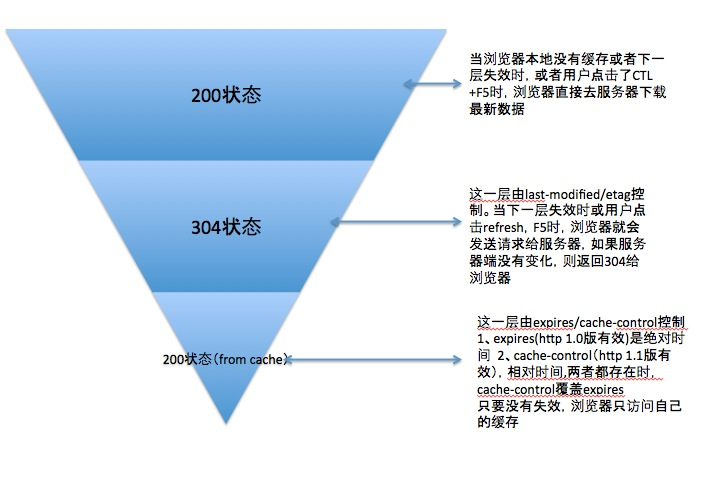

# http cache 问题

`Expires:Thu, 31 Dec 2037 23:55:55 GMT`


`If-Modified-Since:Thu, 26 May 2016 08:59:13 GMT`

`Cache-Control:max-age=0`
`Cache-Control:max-age=315360000`


## client行为
输入网址： `200 OK (from cache)`
> `Pragma:no-cache`
> `Cache-Control:no-cache`
>> #yonka# 行为和ctrl-F5相同，怀疑这个请求根本没发出去

F5： `304 Not Modified`
> `Cache-Control:max-age=0`
> `If-Modified-Since:Sat, 28 May 2016 14:38:09 GMT`
> `Pragma:no-cache`

ctrl-F5：
> `Cache-Control:no-cache`
> `Pragma:no-cache`


## 调研已有方案
BAT看了下，只有百度图片用了etag。

**第一次访问**
请求
```
GET http://img1.imgtn.bdimg.com/it/u=2233569223,2914715962&fm=21&gp=0.jpg HTTP/1.1
Host: img1.imgtn.bdimg.com
Connection: keep-alive
Accept: image/webp,image/*,*/*;q=0.8
User-Agent: Mozilla/5.0 (Windows NT 6.1; WOW64) AppleWebKit/537.36 (KHTML, like Gecko) Chrome/48.0.2564.116 UBrowser/5.6.12860.4 Safari/537.36
Referer: http://image.baidu.com/search/index?tn=baiduimage&ps=1&ct=201326592&lm=-1&cl=2&nc=1&ie=utf-8&word=%E5%9B%BE%E7%89%87
Accept-Encoding: gzip, deflate
Accept-Language: zh-CN,zh;q=0.8
```

> 没有cache相关header

响应
```
HTTP/1.1 200 OK
Server: JSP3/2.0.14
Date: Wed, 01 Jun 2016 07:42:39 GMT
Content-Type: image/jpeg
Content-Length: 8680
Connection: keep-alive
ETag: afde1066465fc0024661c5114a554b3e
Last-Modified: Thu, 01 Jan 1970 00:00:00 GMT
Expires: Sat, 18 Jun 2016 15:00:38 GMT
Age: 861505
Cache-Control: max-age=2628000
Accept-Ranges: bytes
Access-Control-Allow-Origin: *
```

> cache相关：
```
ETag: afde1066465fc0024661c5114a554b3e
Last-Modified: Thu, 01 Jan 1970 00:00:00 GMT
Expires: Sat, 18 Jun 2016 15:00:38 GMT
Age: 861505
Cache-Control: max-age=2628000
```

**第二次（F5）**
请求
```
GET http://pic32.nipic.com/20130829/12906030_124355855000_2.png HTTP/1.1
Host: pic32.nipic.com
Connection: keep-alive
Cache-Control: max-age=0
Accept: image/webp,image/*,*/*;q=0.8
If-None-Match: "05b9c9efba7ce1:0"
If-Modified-Since: Mon, 02 Sep 2013 16:43:58 GMT
User-Agent: Mozilla/5.0 (Windows NT 6.1; WOW64) AppleWebKit/537.36 (KHTML, like Gecko) Chrome/48.0.2564.116 UBrowser/5.6.12860.4 Safari/537.36
Referer: http://image.baidu.com/search/detail?ct=503316480&z=0&ipn=d&word=%E5%9B%BE%E7%89%87&step_word=&pn=0&spn=0&di=113882359580&pi=&rn=1&tn=baiduimagedetail&is=&istype=0&ie=utf-8&oe=utf-8&in=&cl=2&lm=-1&st=undefined&cs=4236942158%2C2307642402&os=665726132%2C356480541&simid=3444347259%2C284796380&adpicid=0&ln=1000&fr=&fmq=1464767407079_R&fm=&ic=undefined&s=undefined&se=&sme=&tab=0&width=&height=&face=undefined&ist=&jit=&cg=&bdtype=0&oriquery=&objurl=http%3A%2F%2Fpic32.nipic.com%2F20130829%2F12906030_124355855000_2.png&fromurl=ippr_z2C%24qAzdH3FAzdH3Fooo_z%26e3Bgtrtv_z%26e3Bv54AzdH3Ffi5oAzdH3F9AzdH3F8d0AzdH3Fb0mnn8a_z%26e3Bip4s&gsm=0&rpstart=0&rpnum=0
Accept-Encoding: gzip, deflate
Accept-Language: zh-CN,zh;q=0.8
```

响应
```
HTTP/1.1 304 Not Modified
Date: Mon, 09 May 2016 06:33:18 GMT
Content-Type: image/png
Last-Modified: Mon, 02 Sep 2013 16:43:58 GMT
ETag: "05b9c9efba7ce1:0"
Cache-Control: max-age=2592000,max-age=2592000
Age: 1
X-Via: 1.1 jiaxingdianxin23:10 (Cdn Cache Server V2.0)
Connection: keep-alive
```

**第三次（输入网址）**
请求
fiddler没抓到 - 没发出
chrome：
...
> cache相关
```
Cache-Control:max-age=0
If-Modified-Since:Mon, 02 Sep 2013 16:43:58 GMT
If-None-Match:"05b9c9efba7ce1:0"
```

响应
同样，只有chrome里的
`Status Code:304 Not Modified (from cache)`

```
Age:1
Cache-Control:max-age=2592000,max-age=2592000
Connection:keep-alive
Content-Type:image/png
Date:Tue, 10 May 2016 09:19:16 GMT
ETag:"05b9c9efba7ce1:0"
Last-Modified:Mon, 02 Sep 2013 16:43:58 GMT
X-Via:1.1 chengdianxin99:6 (Cdn Cache Server V2.0)
```

**第四次（ctrl-F5）**
请求
```
GET http://pic32.nipic.com/20130829/12906030_124355855000_2.png HTTP/1.1
Host: pic32.nipic.com
Connection: keep-alive
Pragma: no-cache
Cache-Control: no-cache
Accept: image/webp,image/*,*/*;q=0.8
User-Agent: Mozilla/5.0 (Windows NT 6.1; WOW64) AppleWebKit/537.36 (KHTML, like Gecko) Chrome/48.0.2564.116 UBrowser/5.6.12860.4 Safari/537.36
Referer: http://image.baidu.com/search/detail?ct=503316480&z=0&ipn=d&word=%E5%9B%BE%E7%89%87&step_word=&pn=0&spn=0&di=113882359580&pi=&rn=1&tn=baiduimagedetail&is=&istype=0&ie=utf-8&oe=utf-8&in=&cl=2&lm=-1&st=undefined&cs=4236942158%2C2307642402&os=665726132%2C356480541&simid=3444347259%2C284796380&adpicid=0&ln=1000&fr=&fmq=1464767407079_R&fm=&ic=undefined&s=undefined&se=&sme=&tab=0&width=&height=&face=undefined&ist=&jit=&cg=&bdtype=0&oriquery=&objurl=http%3A%2F%2Fpic32.nipic.com%2F20130829%2F12906030_124355855000_2.png&fromurl=ippr_z2C%24qAzdH3FAzdH3Fooo_z%26e3Bgtrtv_z%26e3Bv54AzdH3Ffi5oAzdH3F9AzdH3F8d0AzdH3Fb0mnn8a_z%26e3Bip4s&gsm=0&rpstart=0&rpnum=0
Accept-Encoding: gzip, deflate
Accept-Language: zh-CN,zh;q=0.8
```

> cache相关：
```
Pragma: no-cache
Cache-Control: no-cache
```

响应
```
HTTP/1.1 200 OK
Date: Sat, 14 May 2016 03:01:10 GMT
Cache-Control: max-age=2592000,max-age=2592000
Content-Type: image/png
Last-Modified: Mon, 02 Sep 2013 16:43:58 GMT
Accept-Ranges: bytes
ETag: "05b9c9efba7ce1:0"
Server: Microsoft-IIS/7.5
X-Powered-By: ASP.NET
Content-Length: 1014375
Age: 1
X-Via: 1.1 xxxz61:80 (Cdn Cache Server V2.0), 1.1 xz42:9 (Cdn Cache Server V2.0)
Connection: keep-alive
```

## 小结
> 主要参考 [浏览器缓存详解:expires,cache-control,last-modified,etag详细说明](http://blog.csdn.net/eroswang/article/details/8302191)
> 也参考了 [HTTP缓存是如何实现](http://caibaojian.com/http-cache.html)



### etag
etag/If-None-Match配对使用。
属于“强”校验，只要有不同都会...； 而Last-Modified则...

```
HTTP协议规格说明定义ETag为“被请求变量的实体标记”（参见14.19）。简单点即服务器响应时给请求URL标记，并在HTTP响应头中将其传送到客户端，类似服务器端返回的格式：
Etag:“5d8c72a5edda8d6a:3239″
客户端的查询更新格式是这样的：
If-None-Match:“5d8c72a5edda8d6a:3239″
如果ETag没改变，则返回状态304。
即:在客户端发出请求后，HttpReponse Header中包含Etag:“5d8c72a5edda8d6a:3239″
标识，等于告诉Client端，你拿到的这个的资源有表示ID：5d8c72a5edda8d6a:3239。当下次需要发Request索要同一个URI的时候，浏览器同时发出一个If-None-Match报头(Http RequestHeader)此时包头中信息包含上次访问得到的Etag:“5d8c72a5edda8d6a:3239″标识。
If-None-Match:“5d8c72a5edda8d6a:3239“
,这样，Client端等于Cache了两份，服务器端就会比对2者的etag。如果If-None-Match为False，不返回200，返回304(Not Modified) Response。
```

**和Last-Modified一起使用**

相同点
* 这两个都是由服务端使用以确定是否返回具体数据给客户端（还是告知客户端数据无变化 - 使用之前请求到的旧数据） - 省掉的是response（准确的说是response里的body）

区别
* 维度： 数据是否发生变化； 数据的最近修改时间
* 严格性： etag是“强”校验； 而Last-Modified是“弱”校验（允许1min的宽容时间）
* 精度： Last-Modified只能精确到秒，而etag基本无限制理论上有变化都会不同（如一些一秒内发生多次变化的场景... = =）
* 容错/局限性： 有时Last-Modified（主要来自文件mtime）发生变化但文件本身并没有内容修改，此时自然etag更好

关系
* 配合： 可以共同使用，也可以只使用其一，甚至可以都不使用
* 优先级： etag优先于Last-Modified

```python
if ETagFromServer != ETagOnClient or LastModifiedFromServer != LastModifiedOnClient:
   GetFromServer()
else:
   GetFromCache()
```

### Last-Modified
Last-Modified/If-Modified-Since配对使用。
属于“弱”校验，只有当有至少1min的差别才会...

```
在浏览器第一次请求某一个URL时，服务器端的返回状态会是200，内容是你请求的资源，同时有一个Last-Modified的属性标记(HttpReponse Header)此文件在服务期端最后被修改的时间，格式类似这样：
Last-Modified:Tue, 24 Feb 2009 08:01:04 GMT
客户端第二次请求此URL时，根据HTTP协议的规定，浏览器会向服务器传送If-Modified-Since报头(HttpRequest Header)，询问该时间之后文件是否有被修改过：
If-Modified-Since:Tue, 24 Feb 2009 08:01:04 GMT
如果服务器端的资源没有变化，则自动返回HTTP304（NotChanged.）状态码，内容为空，这样就节省了传输数据量。当服务器端代码发生改变或者重启服务器时，则重新发出资源，返回和第一次请求时类似。从而保证不向客户端重复发出资源，也保证当服务器有变化时，客户端能够得到最新的资源。
注：如果If-Modified-Since的时间比服务器当前时间(当前的请求时间request_time)还晚，会认为是个非法请求
```

### cache-control

样例： `Cache-Control: max-age=2592000`

**vs expires**

相同点
* 由客户端使用以确定是否发起请求 - 省掉的是request（自然更省掉了response）

区别
* 版本支持： expires是1.0标准（虽然1.1向下兼容）； cache-control是1.1标准
* 形式： expires是直接指定“过期”*时刻*，会受服务端/客户端时间不一致的影响； cache-control: max-age则是“过期”*时间*，单位为秒，计算方式为 `生效expires = max-age + request-time`，也即每次重新请求都会刷新“生效expires”

关系
* 优先级： 存在cache-control: max-age时，会覆盖（忽略）expires

#### 更多cache-control
|  option    |  含义    |
| :------------- | :------------- |
| Cache-Control: public      | 响应被缓存，并且在多用户间共享       |
| Cache-Control: private       | 响应只能作为私有缓存，不能在用户之间共享       |
| Cache-Control:no-cache       | 提醒浏览器要从服务器提取文档进行验证       |
| Cache-Control:no-store       | 绝对禁止缓存（用于机密，敏感文件）       |
| Cache-Control: max-age=60       | 60秒之后缓存过期（相对时间）       |

### expires

```
给出的日期/时间后，被响应认为是过时。如Expires:Thu, 02 Apr 2009 05:14:08 GMT
需和Last-Modified结合使用。用于控制请求文件的有效时间，当请求数据在有效期内时客户端浏览器从缓存请求数据而不是服务器端.当缓存中数据失效或过期，才决定从服务器更新数据。
```

#### 是否需要和Last-Modified一起使用
> #yonka# 网上说需要，但我了解到的情况，实现本身的功能不需要其他...； 但一般是配合使用，一个负责local-cache一个负责server-validation

### 服务器/客户端行为

#### 服务器

* 服务端并不一定要带上这etag/Last-Modified，不过理论上如果支持的话`应该`带上
* 不过规范规定： 如果校验没通过的，`不允许`返回304，但即便如此，服务器还是可以“强行”返回 - 造成的不完全遵守规范自然是服务器的锅

#### 客户端
> 首先，客户端可以可选的有多种表现，下面说的一般是“正常情况”
* 打开网页 - 先考虑使用本地缓存
* F5 - 不使用本地缓存
* ctrl-F5 - （不使用本地缓存并且）告诉服务端不使用缓存


# linux默认的信号处理方式
* 忽略（丢弃）
* 终止（杀死）进程
* 产生coredump，同时进程终止 - coredump包含对文件虚拟内存的镜像
* 停止进程： 暂停执行
* 恢复之前的停止

## 可以设置对信号的处理
* 默认行为
* 忽略信号
* 执行信号处理程序

> 无法自定义信号处理方式为 终止进程或者产生coredump，不过可以把handler设为执行abort的函数，abort会触发SIGABRT而该信号将引发coredump和进程终止


# 可重入函数
c里边可重入函数的含义几乎等于是： `线程（信号）（或者说多执行流吧）安全`。

# 异步信号安全函数
`可重入` 或者 `信号处理函数无法将其中断` 的函数。

# “为保证安全” 信号处理函数的编写

* handler本身可重入，且只调用异步信号安全的函数
* 当主程序执行不安全函数或者去操作信号处理函数也可能更新的全局数据结构时，阻塞信号的传递
> 比较困难，可以简化为： `信号处理函数绝不调用不安全的函数`


# 信号处理的方式之一： 全局变量（信号标志）、atomic
一种思路是： 信号处理函数只设置全局信号标志，而主函数（main exec-flow）则定期去查看信号标志然后进行对应的处理。
这样的话就需要对全局变量的原子性读写： `sig_atomic_t`
而加上`volatile`使其不被优化到寄存器中。
