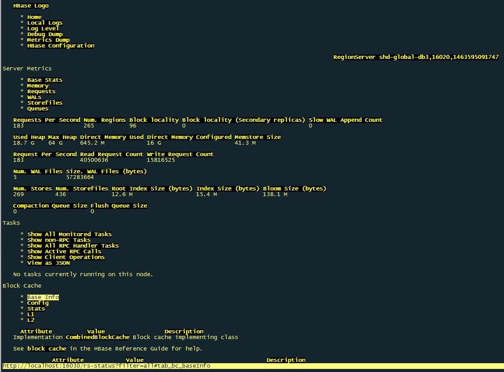

# text web browser 控制台网页浏览器
* elinks
* links
* lynx

用了第一个，感觉很强大。 直接点击交互。 效果如图。



# shell中转义单引号\'
* 双引号包含
> 如 `echo "Don't"`
* 连续字符串
> 如 `echo 'Don'"'"'t'`，略蛋疼
* 前缀加`$`然后用反斜杠
> 如 `echo $'Don\'t'`，没有$前缀的话不行

# hbase端口列表
> 括号里的为低版本的情况

## HMaster
* 16000(60000) 服务端口
* 16010(60010) web端口（监控）

## HRegionServer
* 16020(60020) 服务端口
* 16030(60030) web端口（监控）

参考
```
hbase.rootdir：这个目录是region  server的共享目录，用来持久化Hbase。URL需要是'完全正确'的，还要包含文件系统的scheme。例如，要表示hdfs中的 '/hbase'目录，namenode  运行在namenode.example.org的9090端口。则需要设置为hdfs://namenode.example.org:9000 /hbase。默认情况下Hbase是写到/tmp的。不改这个配置，数据会在重启的时候丢失。默认: file:///tmp/hbase-${user.name}/hbase

hbase.master.port：Hbase的Master的端口.默认: 60000

hbase.cluster.distributed：Hbase的运行模式。false是单机模式，true是分布式模式。若为false,Hbase和Zookeeper会运行在同一个JVM里面。默认: false

hbase.tmp.dir：本地文件系统的临时文件夹。可以修改到一个更为持久的目录上。(/tmp会在重启时清楚)    默认: /tmp/hbase-${user.name}

hbase.master.info.port：HBase Master web 界面端口.     设置为-1 意味着你不想让他运行。默认: 60010

hbase.master.info.bindAddress:HBase Master web 界面绑定的端口   默认: 0.0.0.0

hbase.client.write.buffer:HTable 客户端的写缓冲的默认大小。这个值越大，需要消耗的内存越大。因为缓冲在客户端和服务端都有实例，所以需要消耗客户端和服务端两个地方的内存。得到的好处 是，可以减少RPC的次数。可以这样估算服务器端被占用的内存： hbase.client.write.buffer *  hbase.regionserver.handler.count     默认: 2097152

hbase.regionserver.port:HBase RegionServer绑定的端口     默认: 60020

hbase.regionserver.info.port:HBase RegionServer web 界面绑定的端口     设置为 -1 意味这你不想与运行 RegionServer 界面.    默认: 60030

hbase.regionserver.info.port.auto:Master或RegionServer是否要动态搜一个可以用的端口来绑定界面。当hbase.regionserver.info.port已经被占用的时候，可以搜一个空闲的端口绑定。这个功能在测试的时候很有用。默认关闭。     默认: false

hbase.regionserver.info.bindAddress:HBase RegionServer web 界面的IP地址     默认: 0.0.0.0

hbase.regionserver.class:RegionServer 使用的接口。客户端打开代理来连接region server的时候会使用到。     默认: org.apache.hadoop.hbase.ipc.HRegionInterface

hbase.client.pause:通常的客户端暂停时间。最多的用法是客户端在重试前的等待时间。比如失败的get操作和region查询操作等都很可能用到。默认: 1000

hbase.client.retries.number:最大重试次数。例如 region查询，Get操作，Update操作等等都可能发生错误，需要重试。这是最大重试错误的值。   默认: 10

hbase.client.scanner.caching:当 调用Scanner的next方法，而值又不在缓存里的时候，从服务端一次获取的行数。越大的值意味着Scanner会快一些，但是会占用更多的内存。当 缓冲被占满的时候，next方法调用会越来越慢。慢到一定程度，可能会导致超时。例如超过了 hbase.regionserver.lease.period。    默认: 1

hbase.client.keyvalue.maxsize:一 个KeyValue实例的最大size.这个是用来设置存储文件中的单个entry的大小上界。因为一个KeyValue是不能分割的，所以可以避免因为 数据过大导致region不可分割。明智的做法是把它设为可以被最大region  size整除的数。如果设置为0或者更小，就会禁用这个检查。默认10MB。     默认: 10485760

hbase.regionserver.lease.period:客户端租用HRegion server 期限，即超时阀值。单位是毫秒。默认情况下，客户端必须在这个时间内发一条信息，否则视为死掉。默认: 60000

hbase.regionserver.handler.count:RegionServers受理的RPC Server实例数量。对于Master来说，这个属性是Master受理的handler数量     默认: 10

hbase.regionserver.msginterval:RegionServer 发消息给 Master 时间间隔，单位是毫秒     默认: 3000

hbase.regionserver.optionallogflushinterval:将Hlog同步到HDFS的间隔。如果Hlog没有积累到一定的数量，到了时间，也会触发同步。默认是1秒，单位毫秒。    默认: 1000

hbase.regionserver.regionSplitLimit:region的数量到了这个值后就不会在分裂了。这不是一个region数量的硬性限制。但是起到了一定指导性的作用，到了这个值就该停止分裂了。默认是MAX_INT.就是说不阻止分裂。默认: 2147483647

hbase.regionserver.logroll.period:提交commit log的间隔，不管有没有写足够的值。默认: 3600000

hbase.regionserver.hlog.reader.impl:HLog file reader 的实现.默认: org.apache.hadoop.hbase.regionserver.wal.SequenceFileLogReader

hbase.regionserver.hlog.writer.impl:HLog file writer 的实现.默认: org.apache.hadoop.hbase.regionserver.wal.SequenceFileLogWriter

hbase.regionserver.thread.splitcompactcheckfrequency:region server 多久执行一次split/compaction 检查.     默认: 20000

hbase.regionserver.nbreservationblocks:储备的内存block的数量(译者注:就像石油储备一样)。当发生out of memory 异常的时候，我们可以用这些内存在RegionServer停止之前做清理操作。     

默认: 4

hbase.zookeeper.dns.interface:当使用DNS的时候，Zookeeper用来上报的IP地址的网络接口名字。    默认: default

hbase.zookeeper.dns.nameserver:当使用DNS的时候，Zookeepr使用的DNS的域名或者IP 地址，Zookeeper用它来确定和master用来进行通讯的域名.    默认: default

hbase.regionserver.dns.interface:当使用DNS的时候，RegionServer用来上报的IP地址的网络接口名字。     默认: default

hbase.regionserver.dns.nameserver:当使用DNS的时候，RegionServer使用的DNS的域名或者IP 地址，RegionServer用它来确定和master用来进行通讯的域名.     默认: default

hbase.master.dns.interface:当使用DNS的时候，Master用来上报的IP地址的网络接口名字。    默认: default

hbase.master.dns.nameserver:当使用DNS的时候，RegionServer使用的DNS的域名或者IP 地址，Master用它来确定用来进行通讯的域名.     默认: default

hbase.balancer.period: Master执行region balancer的间隔。     默认: 300000

hbase.regions.slop:当任一regionserver有average + (average * slop)个region是会执行Rebalance     默认: 0

hbase.master.logcleaner.ttl:Hlog存在于.oldlogdir 文件夹的最长时间,     超过了就会被 Master 的线程清理掉.     默认: 600000

hbase.master.logcleaner.plugins:LogsCleaner 服务会执行的一组LogCleanerDelegat。值用逗号间隔的文本表示。这些WAL/HLog  cleaners会按顺序调用。可以把先调用的放在前面。你可以实现自己的LogCleanerDelegat，加到Classpath下，然后在这里写 下类的全称。一般都是加在默认值的前面。     默认: org.apache.hadoop.hbase.master.TimeToLiveLogCleaner

hbase.regionserver.global.memstore.upperLimit:单个region server的全部memtores的最大值。超过这个值，一个新的update操作会被挂起，强制执行flush操作。     默认: 0.4

hbase.regionserver.global.memstore.lowerLimit:当强制执行flush操作的时候，当低于这个值的时候，flush会停止。默认是堆大小的 35% .      如果这个值和 hbase.regionserver.global.memstore.upperLimit 相同就意味着当update操作因为内存限制被挂起时，会尽量少的执行flush(译者注:一旦执行flush，值就会比下限要低，不再执行)     默认: 0.35

hbase.server.thread.wakefrequency:service工作的sleep间隔，单位毫秒。 可以作为service线程的sleep间隔，比如log roller.     默认: 10000

hbase.hregion.memstore.flush.size:当memstore的大小超过这个值的时候，会flush到磁盘。这个值被一个线程每隔hbase.server.thread.wakefrequency检查一下。     默认: 67108864

hbase.hregion.preclose.flush.size:当一个region中的memstore的大小大于这个值的时候，我们又触发了close.会先运行“pre-flush”操作，清理这个需要关闭的 memstore，然后将这个region下线。当一个region下线了，我们无法再进行任何写操作。如果一个memstore很大的时候，flush 操作会消耗很多时间。"pre-flush"操作意味着在region下线之前，会先把memstore清空。这样在最终执行close操作的时 候，flush操作会很快。     默认: 5242880

hbase.hregion.memstore.block.multiplier:如果memstore有hbase.hregion.memstore.block.multiplier倍数的 hbase.hregion.flush.size的大小，就会阻塞update操作。这是为了预防在update高峰期会导致的失控。如果不设上 界，flush的时候会花很长的时间来合并或者分割，最坏的情况就是引发out of  memory异常。(译者注:内存操作的速度和磁盘不匹配，需要等一等。原文似乎有误)     默认: 2

hbase.hregion.memstore.mslab.enabled:体验特性：启用memStore分配本地缓冲区。这个特性是为了防止在大量写负载的时候堆的碎片过多。这可以减少GC操作的频率。(GC有可能会Stop the world)(译者注：实现的原理相当于预分配内存，而不是每一个值都要从堆里分配)     默认: false

hbase.hregion.max.filesize:最大HStoreFile大小。若某个Column families的HStoreFile增长达到这个值，这个Hegion会被切割成两个。       Default: 256M.     默认: 268435456

hbase.hstore.compactionThreshold:当一个HStore含有多于这个值的HStoreFiles(每一个memstore flush产生一个HStoreFile)的时候，会执行一个合并操作，把这HStoreFiles写成一个。这个值越大，需要合并的时间就越长。     默认: 3

hbase.hstore.blockingStoreFiles:当一个HStore含有多于这个值的HStoreFiles(每一个memstore flush产生一个HStoreFile)的时候，会执行一个合并操作，update会阻塞直到合并完成，直到超过了hbase.hstore.blockingWaitTime的值     默认: 7

hbase.hstore.blockingWaitTime:hbase.hstore.blockingStoreFiles所限制的StoreFile数量会导致update阻塞，这个时间是来限制阻塞时间的。当超过了这个时间，HRegion会停止阻塞update操作，不过合并还有没有完成。默认为90s.     默认: 90000

hbase.hstore.compaction.max:每个“小”合并的HStoreFiles最大数量。     默认: 10

hbase.hregion.majorcompaction:一个Region中的所有HStoreFile的major compactions的时间间隔。默认是1天。 设置为0就是禁用这个功能。     默认: 86400000

hbase.mapreduce.hfileoutputformat.blocksize:MapReduce 中HFileOutputFormat可以写 storefiles/hfiles. 这个值是hfile的blocksize的最小值。通常在Hbase写Hfile的时候，bloocksize是由table  schema(HColumnDescriptor)决定的，但是在mapreduce写的时候，我们无法获取schema中blocksize。这个值 越小，你的索引就越大，你随机访问需要获取的数据就越小。如果你的cell都很小，而且你需要更快的随机访问，可以把这个值调低。     默认: 65536

hfile.block.cache.size:分配给HFile/StoreFile的block cache占最大堆(-Xmx setting)的比例。默认是20%，设置为0就是不分配。       默认: 0.2

hbase.hash.type:哈希函数使用的哈希算法。可以选择两个值:: murmur (MurmurHash) 和 jenkins (JenkinsHash).     这个哈希是给 bloom filters用的.     默认: murmur

hbase.master.keytab.file:

HMaster server验证登录使用的kerberos keytab 文件路径。(译者注：Hbase使用Kerberos实现安全)     

hbase.master.kerberos.principal:例 如. "hbase/_HOST@EXAMPLE.COM".  HMaster运行需要使 用 kerberos principal name.  principal name 可以在: user/hostname@DOMAIN 中获 取. 如果 "_HOST" 被用做hostname     portion，需要使用实际运行的hostname来替代它。     

hbase.regionserver.keytab.file:HRegionServer验证登录使用的kerberos keytab 文件路径。     

hbase.regionserver.kerberos.principal:例 如. "hbase/_HOST@EXAMPLE.COM".  HRegionServer运行需要使 用 kerberos principal name.  principal name 可以在: user/hostname@DOMAIN 中获 取. 如果 "_HOST" 被用做hostname     portion，需要使用实际运行的hostname来替代它。在这个文件中必须要有一个entry来描 述 hbase.regionserver.keytab.file     

zookeeper.session.timeout:ZooKeeper   会话超时.Hbase把这个值传递改zk集群，向他推荐一个会话的最大超时时间。单位是毫秒     默认: 180000

zookeeper.znode.parent:ZooKeeper中的Hbase的根ZNode。所有的Hbase的ZooKeeper会用这个目录配置相对路径。默认情况下，所有的Hbase的ZooKeeper文件路径是用相对路径，所以他们会都去这个目录下面。     默认: /hbase

zookeeper.znode.rootserver:ZNode  保存的 根region的路径. 这个值是由Master来写，client和regionserver 来读的。如果设为一个相对地址，父目录就是  ${zookeeper.znode.parent}.默认情形下，意味着根region的路径存储在/hbase/root-region- server.     默认: root-region-server

hbase.zookeeper.quorum:Zookeeper 集群的地址列表，用逗号分割。例 如："host1.mydomain.com,host2.mydomain.com,host3.mydomain.com".默认是 localhost,是给伪分布式用的。要修改才能在完全分布式的情况下使用。如果在hbase-env.sh设置了HBASE_MANAGES_ZK， 这些ZooKeeper节点就会和Hbase一起启动。         默认: localhost

hbase.zookeeper.peerport:ZooKeeper节点使用的端口。默认: 2888

hbase.zookeeper.leaderport:ZooKeeper用来选择Leader的端口. 默认: 3888

hbase.zookeeper.property.initLimit:ZooKeeper的zoo.conf中的配置。 初始化synchronization阶段的ticks数量限制     默认: 10

hbase.zookeeper.property.syncLimit:ZooKeeper的zoo.conf中的配置。 发送一个请求到获得承认之间的ticks的数量限制     默认: 5

hbase.zookeeper.property.dataDir:ZooKeeper的zoo.conf中的配置。     快照的存储位置     默认: ${hbase.tmp.dir}/zookeeper

hbase.zookeeper.property.clientPort:ZooKeeper的zoo.conf中的配置。 客户端连接的端口     默认: 2181

hbase.zookeeper.property.maxClientCnxns:ZooKeeper的zoo.conf中的配置。 ZooKeeper集群中的单个节点接受的单个Client(以IP区分)的请求的并发数。这个值可以调高一点，防止在单机和伪分布式模式中出问题。默认: 2000

hbase.rest.port:HBase REST server的端口      默认: 8080

hbase.rest.readonly:定义REST server的运行模式。可以设置成如下的值：     false: 所有的HTTP请求都是被允许的 - GET/PUT/POST/DELETE.     true:只有GET请求是被允许的     默认: false
```
