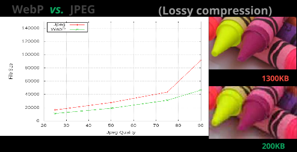
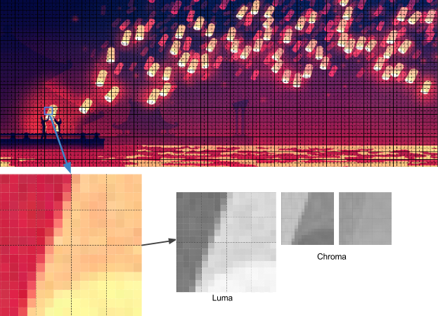
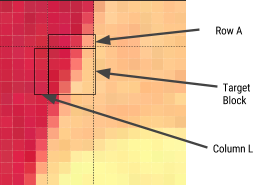
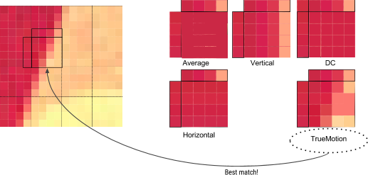
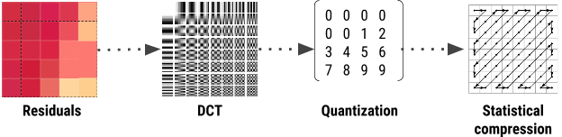

# lua 正则库 lpeg
据说不错。
参考：
* [Lua 的解析表达式语法](http://www.oschina.net/translate/lpeg-syntax)
* [LPeg编程指南](http://blog.csdn.net/liwenxin_at/article/details/50404524)

# jpg/jpeg质量变换小结

```
所以jpg如果是80压缩的，一般只能继续80(-)下去，80+的话只会增加体积减小实际质量。

-rw-r--r--. 1 root root  71K Aug 12  2016 e473c7b65a483d6930cefbfe4677728611d368c7.jpg
-rw-r--r--. 1 root root 189K Aug 12  2016 e473c7b65a483d6930cefbfe4677728611d368c7.jpg@100Q
-rw-r--r--. 1 root root  71K Aug 12  2016 e473c7b65a483d6930cefbfe4677728611d368c7.jpg@80Q
# root @ local_centos in /tmp [15:50:12] tty:pts/0 L:1 N:172
$ identify -format '%Q' e473c7b65a483d6930cefbfe4677728611d368c7.jpg    
80

# root @ local_centos in /tmp [15:50:22] tty:pts/0 L:1 N:173
$ identify -format '%Q' e473c7b65a483d6930cefbfe4677728611d368c7.jpg@100Q
100
$ identify -format '%Q' e473c7b65a483d6930cefbfe4677728611d368c7.jpg@80Q
80

$ md5sum e473c7b65a483d6930cefbfe4677728611d368c7.jpg*
2a7b7612355a3f98c3211dde3924b2a6  e473c7b65a483d6930cefbfe4677728611d368c7.jpg
552ff90caf2075f20e5cf8e4141ebf12  e473c7b65a483d6930cefbfe4677728611d368c7.jpg@100Q
bcfff77956e871cde3e64aefaffed4ca  e473c7b65a483d6930cefbfe4677728611d368c7.jpg@80Q

结论： 同等质量转换，几乎大小不变，算出来的quality也不变，md5发生变化（说明文件内容还是有点不同）
```

## 肉眼测试
> 原图质量80, 71K/71901

| 操作 | 大小变化 | identify -format '%Q' 结果 | md5 | 肉眼效果 |
| :--- | :--- | :--- | :--- | :--- |
| 转为100 | 增大（189K/193439） | 100 | 变化| 看不出变化 |
| 转为80 | 几乎不变（71783） | 80 | 变化 | 看不出变化 |
| 转为70 | 减小（64380） | 70 | 变化 | 肉眼可见效果变差） |

**结论**
从低到高转换： 质量几乎不变（网上说会降低，但肉眼似乎不可辨），但size有明显增加。 尤其是转为100的话类似重置了quality，成为一张“全新的质量不佳的图”
从高到低转换： 质量降低，size降低

**务必不要用更高的质量进行jpg转换**
比较好的处理方式是用**相对质量转换**，如给原质量80的图传90的压缩质量参数，则压为72质量的新图。 阿里云图片服务的`q`参数就是这样的。
还可以对实际使用的质量参数做**“限高”**，也即和当前质量做比较取较小值。
但是这两种方式都需要算出原图质量参数，目前只发现Magick++可以，需要load图片为Image，而我们目前主要用opencv方案，load两边代价有点大。 哎。


# 关于图片的几点认识
> ref: [PNG vs JPG: 6 simple lessons you can learn from our mistakes](https://www.turnkeylinux.org/blog/png-vs-jpg)

* png是无损格式，但不够经济
> 所以只适合部分场景。 肉眼难以看出差距的对应jpg格式图片也许只有png格式的1/4大小。
* jpg不支持透明度
> 对于需要透明度又希望图片小一些的场景就很纠结了，对png的优化（缩小size）是很难的，而且往往带来无法接受的图片显示质量下降
* 调整压缩（质量参数）比调整分辨率更合适，后者带来的显示质量下降更明显
* 尽量保留无损的格式（如PNG）作为“母本”
* 对于小/简单的图片，png也许也不是那么expensive；而jpg在复杂色彩梯度的图片上更有优势（典型图片）

# webp简介
> ref: [How WebP works (lossly mode)](https://medium.com/@duhroach/how-webp-works-lossly-mode-33bd2b1d0670#.f1nk5b8ri)

* 相比jpg的优势
> 保持同样质量条件下，size比jpg小`24%-35%` - 根据原图size和复杂度而定



* 来源 - webm
> VP8 video codec/WebM，支持帧内压缩，也即每帧都进行压缩
> webp就是webm的压缩帧 - 源于，后来针对图片做了一些更新和改动

* 有损模式
> webp的有损模式主要与jpg竞争

* macroblocking 宏分块？
> 把图片分成一个个的macro block，典型的macro block由 1个16x16 luma像素的块 和 2个8x8 chroma像素的块 组成
> 这一步和jpg的做法类似： 转换颜色空间、对chroma通道降采样、subdividing图片



* 预测
为macroblock的每个4x4块应用apply一个预测模型（aka过滤）（png里也使用了过滤，不过是逐行的）。
webp的过滤方式是按block的。定义了两组像素： 其上的（row A）、其左的（col L），见图。


Using A and L, the encoder will fill in a test block of 4x4 pixels, and determine which one produces values closest to the original block. The different ways these blocks can be filled are called “Predictors”:
* Horiz prediction — Each column of the block with a copy of the previous column
* Vertical Prediction — fills each row of the block with a copy of a previous row
* DC Prediction — fills block with a single value using the average of the pixels in the row above A and the column to the left of L
* True Motion prediction — a super advanced mode I’m not getting into right now.
It’s worth noting, btw 4x4 luma has 6 additional modes, but you get the picture at this point ;)


* jpg化 - jpgify
这一步也和jpg很像
1. 做DCT过滤
2. DCT基本矩阵量化/数字化（quantization）
3. 量化矩阵重排序后传给统计压缩器



和jpg的区别：
1. 传给DCT的不是原始块，而是预测环节的输出
2. webp使用的统计压缩器是算术压缩器，和jpg使用的哈夫曼编码器类似
