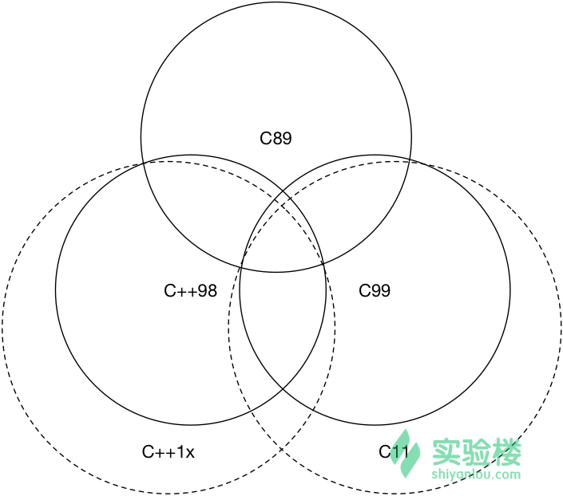

# 确认opencv对tiff的支持

```
Note OpenCV offers support for the image formats Windows bitmap (bmp), portable image formats (pbm, pgm, ppm) and Sun raster (sr, ras). With help of plugins (you need to specify to use them if you build yourself the library, nevertheless in the packages we ship present by default) you may also load image formats like JPEG (jpeg, jpg, jpe), JPEG 2000 (jp2 - codenamed in the CMake as Jasper), TIFF files (tiff, tif) and portable network graphics (png). Furthermore, OpenEXR is also a possibility.
```
官方说法是OK的。


```
  Media I/O: 
    ZLib:                        /usr/lib/x86_64-linux-gnu/libz.so (ver 1.2.8)
    JPEG:                        /usr/lib/x86_64-linux-gnu/libjpeg.so (ver )
    WEBP:                        build (ver 0.3.1)
    PNG:                         /usr/lib/x86_64-linux-gnu/libpng.so (ver 1.2.50)
    TIFF:                        /usr/lib/x86_64-linux-gnu/libtiff.so (ver 42 - 4.0.3)
    JPEG 2000:                   /usr/lib/x86_64-linux-gnu/libjasper.so (ver 1.900.1)
    OpenEXR:                     /usr/lib/x86_64-linux-gnu/libImath.so /usr/lib/x86_64-linux-gnu/libIlmImf.so /usr/lib/x86_64-linux-gnu/libIex.so /usr/lib/x86_64-linux-gnu/libHalf.so /usr/lib/x86_64-linux-gnu/libIlmThread.so (ver 1.6.1)
    GDAL:                        NO
```

测了下，静态tiff图应该是可以的，但部分好像会load失败，估计是编码不规范吧。
动态tiff的话，因为没找到动tiff图没有实测，但根据 [Can I load a multi-frame TIFF through OpenCV?](http://stackoverflow.com/questions/7335308/can-i-load-a-multi-frame-tiff-through-opencv)  来看是不行的。

> 对于16bit tiff，需要用 CV_LOAD_IMAGE_ANYDEPTH 


# rrd初探
ganglia监控hbase时，数据收过来是每个metric作为一个rrd文件。
文件比较大，所以好奇里边的收集粒度，毕竟不至于这么大...

rrd相关的工具有rrdtool，好像功能还很丰富。一时间了解不了太多，只说查看文件内容的：`rrdtool dump`。

```
rrdtool dump regionserver.Regions.Namespace_hbase_table_namespace_region_7873a33ee1c423ecd6ef441cdc384a39_metric_get_75th_percentile.rrd > regionserver.Regions.Namespace_hbase_table_namespace_region_7873a33ee1c423ecd6ef441cdc384a39_metric_get_75th_percentile.xml
```

```xml
<?xml version="1.0" encoding="utf-8"?>
<!DOCTYPE rrd SYSTEM "http://oss.oetiker.ch/rrdtool/rrdtool.dtd">
<!-- Round Robin Database Dump -->
<rrd>
        <version>0003</version>
        <step>15</step> <!-- Seconds -->
        <lastupdate>1472728665</lastupdate> <!-- 2016-09-01 19:17:45 CST -->

        <ds>
                <name> sum </name>
                <type> GAUGE </type>
                <minimal_heartbeat>120</minimal_heartbeat>
                <min>NaN</min>
                <max>NaN</max>

                <!-- PDP Status -->
                <last_ds>41.00000</last_ds>
                <value>NaN</value>
                <unknown_sec> 0 </unknown_sec>
        </ds>

        <ds>
                <name> num </name>
                <type> GAUGE </type>
                <minimal_heartbeat>120</minimal_heartbeat>
                <min>NaN</min>
                <max>NaN</max>

                <!-- PDP Status -->
                <last_ds>1</last_ds>
                <value>NaN</value>
                <unknown_sec> 0 </unknown_sec>
        </ds>

        <!-- Round Robin Archives -->
        <rra>
                <cf>AVERAGE</cf>
                <pdp_per_row>1</pdp_per_row> <!-- 15 seconds -->

                <params>
                <xff>5.0000000000e-01</xff>
                </params>
                <cdp_prep>
                        <ds>
                        <primary_value>NaN</primary_value>
                        <secondary_value>NaN</secondary_value>
                        <value>NaN</value>
                        <unknown_datapoints>0</unknown_datapoints>
                        </ds>
                        <ds>
                        <primary_value>NaN</primary_value>
                        <secondary_value>NaN</secondary_value>
                        <value>NaN</value>
                        <unknown_datapoints>0</unknown_datapoints>
                        </ds>
                </cdp_prep>
                <database>
                        <!-- 2016-08-31 18:54:00 CST / 1472640840 --> <row><v>NaN</v><v>NaN</v></row>
                        <!-- 2016-08-31 18:54:15 CST / 1472640855 --> <row><v>NaN</v><v>NaN</v></row>
                        <!-- 2016-08-31 18:54:30 CST / 1472640870 --> <row><v>NaN</v><v>NaN</v></row>
                        ...
                        <!-- 2016-09-01 18:10:00 CST / 1472724600 --> <row><v>NaN</v><v>NaN</v></row>
                        <!-- 2016-09-01 18:20:00 CST / 1472725200 --> <row><v>NaN</v><v>NaN</v></row>
                        <!-- 2016-09-01 18:30:00 CST / 1472725800 --> <row><v>NaN</v><v>NaN</v></row>
                        <!-- 2016-09-01 18:40:00 CST / 1472726400 --> <row><v>NaN</v><v>NaN</v></row>
                        <!-- 2016-09-01 18:50:00 CST / 1472727000 --> <row><v>NaN</v><v>NaN</v></row>
                        <!-- 2016-09-01 19:00:00 CST / 1472727600 --> <row><v>NaN</v><v>NaN</v></row>
                        <!-- 2016-09-01 19:10:00 CST / 1472728200 --> <row><v>NaN</v><v>NaN</v></row>
                </database>
        </rra>
</rrd>                        
```

发现是好几天的数据，所以才比较大。
同时，好奇的是，早期的数据是15s一次，比较新的数据反而是10分钟一次。 不懂...

hbase metric本身会保留几天的数据？ ganglia 1号才启动似乎...

## rrdtool ref
官网： [RRDtool](http://oss.oetiker.ch/rrdtool/index.en.html)

# logrotate的配置文件中加注释

```
The first few lines set global options; in the example, logs are compressed after they are rotated. Note that comments may appear anywhere in the config file as long as the first non-whitespace character on the line is a #.
```

第一个非空白字符为`#`的都是注释

# 各版本c和各版本c++的关系
见图


