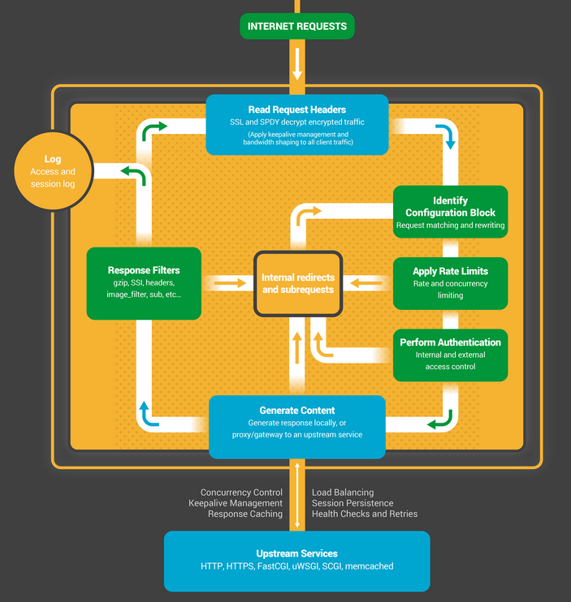

# nginx处理阶段小结
> ref: [openresty最佳实践 - 执行阶段概念](https://moonbingbing.gitbooks.io/openresty-best-practices/content/ngx_lua/phase.html)

如下图：


## lua介入的阶段
* set_by_lua: 流程分支处理判断变量初始化
* rewrite_by_lua: 转发、重定向、缓存等功能(例如特定请求代理到外网)
* access_by_lua: IP准入、接口权限等情况集中处理(例如配合iptable完成简单防火墙)
* content_by_lua: 内容生成
* header_filter_by_lua: 应答HTTP过滤处理(例如添加头部信息)
* body_filter_by_lua: 应答BODY过滤处理(例如完成应答内容统一成大写)
* log_by_lua: 会话完成后本地异步完成日志记录(日志可以记录在本地，还可以同步到其他机器)

# nginx proxy_pass 使用
> ref: [Nginx proxy_pass: examples for how does nginx proxy_pass map the request](http://www.liaohuqiu.net/posts/nginx-proxy-pass/)

```
1. about

The proxy_pass directive sets the address of the proxied server and the URI to which location will be mapped.

Here are some examples to show how the request URI will be mapped.

The version of nginx:

nginx version: nginx/1.4.2
The server config:

#server config
server {
    listen        80;
    server_name   test.com;
}
2. location without regular expression

If the proxy_pass directive is specified without a URI,

location /app/ {
    proxy_pass      http://192.168.154.102;
}

test.com/app/xxxxx =>  http://192.168.154.102/xxxxx
If the proxy_pass directive is specified with a URI:

location /app/ {
    proxy_pass      http://192.168.154.102/maped_dir/;
}

test.com/app/xxxxx =>  http://192.168.154.102/maped_dir/xxxxx
Forward the requested Host header

By default, the Host header from the request is not forwarded, but is set based on the proxy_pass statement. To forward the requested Host header, it is necessary to use:

proxy_set_header Host $host;
3. location with regular expression

If the location is given by regular expression, can not be a URI part in proxy_pass directive, unless there are variables in the directive.

location  ~ ^/app/(.*)$ {
    #proxy_pass   http://127.0.0.1/some_dir;    #error
    proxy_pass   http://127.0.0.1/some_dir/$1r;    #ok
}
variables in proxy_pass directive:

location ~ ^/app/(.*)$ {
    proxy_pass       http://192.169.154.102:$1;
}

test.com/app/8081 => http://192.168.154.102:8081
and:

location ~ ^/app/(.*)$ {
    proxy_pass       http://192.169.154.102:9999/some_dir/$1;
}

test.com/app/request/xxxxx => http://192.168.154.102:9999/some_dir/xxxxx
with a rewrite directive in the location:

If the rewrite rule is hit, the URI specified in the directive is ignored and the full changed request URI is passed to the server:

location  /app/ {
    rewrite    ^/app/hit/(.*)$ /hit_page.php?path=$1 break;
    proxy_pass   http://192.168.154.102:9999/some_dir/;
}
/app/hit/some/request/?name=xxxxx

=> http://192.168.154.102:9999/hit_page.php?path=some/request/&name=xxxxx

/app/not_hit/some/request/?name=xxxxx

=> http://192.168.154.102:9999/some_dir/not_hit/some/request/?name=xxxxx
```

