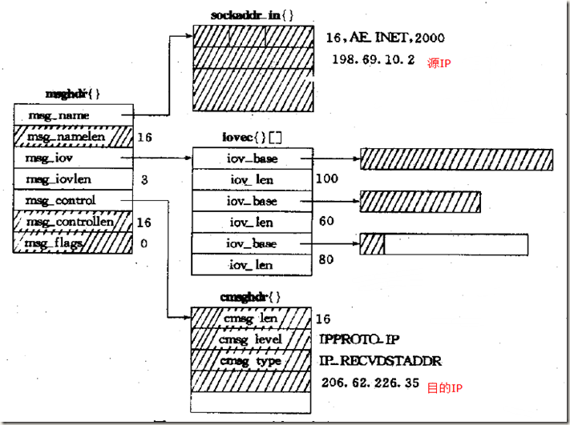
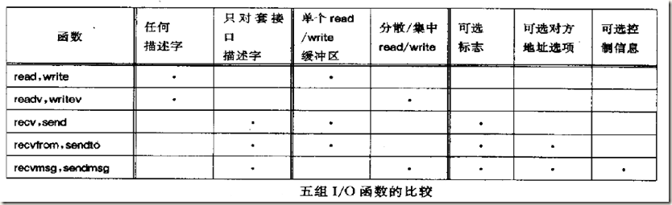

# linux中mv操作会改变ctime

atime： access，内容读取
mtime： modify，内容修改
ctime： change，inode修改

> 一度恍惚了，以为ctime只是指create time

mv的

```
# root @ local_centos in /tmp [18:35:20] tty:pts/6 L:1 N:69
$ stat t.c
  File: ‘t.c’
  Size: 293             Blocks: 8          IO Block: 4096   regular file
Device: fd00h/64768d    Inode: 102426448   Links: 1
Access: (0644/-rw-r--r--)  Uid: (    0/    root)   Gid: (    0/    root)
Context: unconfined_u:object_r:user_tmp_t:s0
Access: 2016-11-08 14:13:53.461081496 +0800
Modify: 2016-11-08 14:13:50.701061952 +0800
Change: 2016-11-08 14:13:50.701061952 +0800
 Birth: -

# root @ local_centos in /tmp [18:35:25] tty:pts/6 L:1 N:70
$ mv t.c t1.c

# root @ local_centos in /tmp [18:35:55] tty:pts/6 L:1 N:71
$ stat t1.c  
  File: ‘t1.c’
  Size: 293             Blocks: 8          IO Block: 4096   regular file
Device: fd00h/64768d    Inode: 102426448   Links: 1
Access: (0644/-rw-r--r--)  Uid: (    0/    root)   Gid: (    0/    root)
Context: unconfined_u:object_r:user_tmp_t:s0
Access: 2016-11-08 14:13:53.461081496 +0800
Modify: 2016-11-08 14:13:50.701061952 +0800
Change: 2016-11-10 18:35:55.631759365 +0800
 Birth: -
```


## ctime修改场景
```
A long, long time ago, the command

mv oldpath newpath
was implemented inside mv.c as

link(oldpath, newpath);
unlink(newpath);
Now we have a system call

rename(oldpath, newpath);
but apparently it still works the same way, inside the kernel.  This is a conjecture on my part, but it’s based on the fact that one of the failure modes for rename(2) is

EMLINK

oldpath already has the maximum number of links to it, or ...
and based on the experimental data that you reported (and that I confirmed on my own system).

And so...

When oldpath gets linked to newpath, the inode’s link count goes up by one.  When oldpath gets unlinked, the inode’s link count goes down by one. Therefore, the inode gets changed (even though it immediately gets changed back to the way it was before).

P.S. It’s interesting to note that the POSIX document lists EMLINK as a possible error return code, but not for the case of file-to-file rename.
```

```
# root @ local_centos in /tmp [18:35:57] tty:pts/6 L:1 N:72
$ cp --help | grep "\-p"
  -a, --archive                same as -dR --preserve=all
  -d                           same as --no-dereference --preserve=links
  -p                           same as --preserve=mode,ownership,timestamps
      --preserve[=ATTR_LIST]   preserve the specified attributes (default:
  -c                           deprecated, same as --preserve=context
      --no-preserve=ATTR_LIST  don't preserve the specified attributes
      --parents                use full source file name under DIRECTORY
```

## create time如何获得？
```
The field gets populated (see below) only coreutils stat does not display it. Apparently they're waiting1 for the xstat() interface.

coreutils patches - aug. 2012 - TODO

stat(1) and ls(1) support for birth time. Dependent on xstat() being provided by the kernel
You can get the creation time via debugfs:

debugfs -R 'stat <inode_number>' DEVICE
e.g. for my /etc/profile which is on /dev/sda2 (see How to find out what device a file is on):

stat -c %i /etc/profile
398264
debugfs -R 'stat <398264>' /dev/sda2
debugfs 1.42.5 (29-Jul-2012)
Inode: 398264   Type: regular    Mode:  0644   Flags: 0x80000
Generation: 2058737571    Version: 0x00000000:00000001
User:     0   Group:     0   Size: 562
File ACL: 0    Directory ACL: 0
Links: 1   Blockcount: 8
Fragment:  Address: 0    Number: 0    Size: 0
 ctime: 0x506b860b:19fa3c34 -- Wed Oct  3 02:25:47 2012
 atime: 0x50476677:dcd84978 -- Wed Sep  5 16:49:27 2012
 mtime: 0x506b860b:19fa3c34 -- Wed Oct  3 02:25:47 2012
crtime: 0x50476677:dcd84978 -- Wed Sep  5 16:49:27 2012
Size of extra inode fields: 28
EXTENTS:
(0):3308774
```

```
root@dapper-app-02:/tmp # debugfs -R 'stat boot_result' /dev/vda1      
debugfs 1.42.12 (29-Aug-2014)
boot_result: File not found by ext2_lookup 

root@dapper-app-02:/tmp # debugfs -R 'stat -c %i boot_result' /dev/vda1                                      
debugfs 1.42.12 (29-Aug-2014)
stat: Usage: stat <file>

root@dapper-app-02:/tmp # stat -c %i boot_result 
915312

root@dapper-app-02:/tmp # debugfs -R 'stat <915312>' /dev/vda1           
debugfs 1.42.12 (29-Aug-2014)
Inode: 915312   Type: regular    Mode:  0644   Flags: 0x80000
Generation: 1725761263    Version: 0x00000000:00000001
User:     0   Group:     0   Size: 84
File ACL: 0    Directory ACL: 0
Links: 1   Blockcount: 8
Fragment:  Address: 0    Number: 0    Size: 0
 ctime: 0x5785dfeb:3fe56c00 -- Wed Jul 13 14:30:03 2016
 atime: 0x582450df:ee18adf0 -- Thu Nov 10 18:50:07 2016
 mtime: 0x5785dfeb:3fe56c00 -- Wed Jul 13 14:30:03 2016
crtime: 0x5785dfe9:3567e000 -- Wed Jul 13 14:30:01 2016
Size of extra inode fields: 28
EXTENTS:
(0):3705356
```


但是！ xfs不支持。

```
XFS does not support creation time. It just has the regular atime, mtime and ctime. There are no plans that I've heard to support it
Source: http://comments.gmane.org/gmane.comp.file-systems.xfs.general/20629
```

```
/dev/sdb               /data            xfs   defaults        0 0

# root @ local_centos in /tmp [18:45:09] tty:pts/6 L:1 N:84
$ debugfs -R 'stat -c %i /data/tmp/t1.c' /dev/sdb     
debugfs 1.42.9 (28-Dec-2013)
/dev/sdb: Bad magic number in super-block while opening filesystem
stat: Filesystem not open
```

### golang中的create time

```golang
type Stat_t struct {
    Dev       uint64
    Ino       uint64
    Nlink     uint64
    Mode      uint32
    Uid       uint32
    Gid       uint32
    X__pad0   int32
    Rdev      uint64
    Size      int64
    Blksize   int64
    Blocks    int64
    Atim      Timespec
    Mtim      Timespec
    Ctim      Timespec
    X__unused [3]int64
}
```

也没有crtime。

# 随手写的go sort工具
```golang
type fileInfos struct {
    data []*fileInfo
    cmp  func(fi1, fi2 *fileInfo) int
}

func (fis fileInfos) Len() int {
    return len(fis.data)
}
func (fis fileInfos) Less(i, j int) bool {
    return fis.cmp(fis.data[i], fis.data[j]) < 0
}
func (fis fileInfos) Swap(i, j int) {
    fis.data[i], fis.data[j] = fis.data[j], fis.data[i]
}
```

data改为`[]interface`就可以了。

# 问题： es机器jbd2/vdb-8进程/线程 io过高
io吃到了77.68%，虽然是虚机，但也太高了。

jdb2/vdb-8

```
/dev/vdb on /data/ type ext4 (rw,relatime,errors=remount-ro,data=ordered)
```

## ref

```
几个月前，有同事因为需要对某项功能进行压力测试，测试mysql的读写性能。当时测下来的结果非常不满意，本地测试环境性能巨差无比，当时我帮忙找问题，top看cpu、内存完全没有问题，iotop看到有jbd2 I/O占用到了99%。压力测试一结束，也随之降下来。当时排查了一段时间，始终没有搞定，就放弃了。就在这周，还是需要测试mysql性能，还是因为这个问题，我就花了一个下午的时间，终于解决了。

首先我们应该了解一下jbd2是什么东西。为什么I/O会如此之高。随便google一下，都有问到jbd2如何关闭。但是没有一个答案是能搞定的。wikipedia下是这样定义的（JBD）：

The Journaling Block Device (JBD) provides a filesystem-independent interface for filesystem journaling. ext3, ext4 and OCFS2 are known to use JBD. OCFS2 starting from linux 2.6.28 and ext4 use a fork of JBD called JBD2

那如何关闭JBD2呢？

首先用 dumpe2fs /dev/sda6 | more 查看Filesystem Feature下有木有has_journal。如果没有就不用看了 -_-

tune2fs -o journal_data_writeback /dev/sda6
tune2fs -O "^has_journal" /dev/sda6
e2fsck -f /dev/sda6
同时在fstab下重新设定一下，在defaults之后增加

defaults,data=writeback,noatime,nodiratime
重启之后，在使用dumpe2fs查看，若没有了，那说明已经把jbd关闭了。

如果使用tune2fs时候，提示disk正在mount，如果是非系统盘下，你可以使用

fuser -km /home #杀死所有使用/home下的进程
umount /dev/sda6 #umount
之后在使用上面的命令进行移除has_journal

你现在在google上搜索“jbd2/sda1-8 high io”，仍然没有一个完整的解决方案，希望这文章能帮到你。
```


## 跟进

ref:
* [解决因jbd2导致mysql性能过低问题](https://blog.wolftankk.com/2015/05/01/solved-jbd2-high-io-for-mysql-running-slow/)
* [修复ext4日志（jbd2）bug](http://blog.donghao.org/2013/03/20/%E4%BF%AE%E5%A4%8Dext4%E6%97%A5%E5%BF%97%EF%BC%88jbd2%EF%BC%89bug/)
* [jbd2 process (ext4 journal) is writing on disk all the time](https://bbs.archlinux.org/viewtopic.php?id=113516)

ref里提到可能是ext4的bug

```
既然这么容易重现为什么其它机器上没有遇到？原因就是这个commit_request必须是一个很大的值，大到转为int型时会变为负数。我试了一下在ext4上不停的创建空文件并fdatasync之，10分钟左右commit_request才变为一百万，如果要让它到二十亿，至少还需要十四天，而线上的io压力毕竟没有人工压力测试那么大，所以几个月后commit_request才到二十亿，才触发了这个bug。
```

```
jbd2 process is for ext4 journalling. It is logical that filesystem needs to write into journal during mysql commits, this should not be reason for any worries. The amount of load caused by jbd is influenced by your mount parameters for dm-10-8 and dm-14-8 partitions. It is probably desirable to have very conservatiove journalling at database partition to ensure that your database does not get corrupted if something happens and your server accidentally reboots. You can select another journalling mount options in test environment just for comparison.
```

# golang的一些坑/注意事项
ref: [Go的50度灰：Golang新开发者要注意的陷阱和常见错误](http://colobu.com/2015/09/07/gotchas-and-common-mistakes-in-go-golang/) or [Go的50度灰：Golang新开发者要注意的陷阱和常见错误 _ 鸟窝 - local](resource/Go的50度灰：Golang新开发者要注意的陷阱和常见错误 _ 鸟窝.html)

# golang variable shadowing 变量（名）隐藏

如：
```golang
func f(n int) (res int, err error) {
    if _, err := f(n-1); err != nil {
        return  // invalid return statement: err is shadowed
    }
    return
}
```

像if这种情况是无豁免的，即使有新变量声明，如：
```golang
func f(n int) (res int, err error) {
    if a, err := f(n-1); err != nil {
        // do sth with a
        return  // invalid return statement: err is shadowed
    }
    return
}
```

演示：
```golang
$ ./go
get 1, met haha
met <nil>

# root @ local_centos in /tmp/go [16:11:59] tty:pts/6 L:1 N:116
$ cat t.go
package main

import "fmt"
import "errors"

func f() (int, error) {
        return 1, errors.New("haha")
}

func ff() (err error) {
        if i, err := f(); err != nil {
                fmt.Printf("get %d, met %v\n", i, err)
        }
        return
}

func main() {
        err := ff()
        fmt.Printf("met %v\n", err)

}
```

而在top scope里有一种豁免情况：
```golang
func f(n int) (res int, err error) {
    a, err := f1(n-1)  // here err is not shadowed
    return
}
```

如果有新变量名声明的话，不会shadow，也即此时对err是赋值而不是新的声明。
换句话说，没有新的inner scope时，没有shadow的说法，只有 新声明、赋值、新声明+赋值 这几种情况。

# 关于udp packet boundary的问题

如何判断`读完了`udp包。

## c中对udp的操作
```c
       #include <sys/types.h>
       #include <sys/socket.h>

       ssize_t recv(int sockfd, void *buf, size_t len, int flags);

       ssize_t recvfrom(int sockfd, void *buf, size_t len, int flags,
                        struct sockaddr *src_addr, socklen_t *addrlen);

       ssize_t recvmsg(int sockfd, struct msghdr *msg, int flags);

```

```
       The recvmsg() call uses a msghdr structure to minimize the number of directly supplied arguments.  This structure is defined as follows in <sys/socket.h>:
```

```c
           struct iovec {                    /* Scatter/gather array items */
               void  *iov_base;              /* Starting address */
               size_t iov_len;               /* Number of bytes to transfer */
           };

           struct msghdr {
               void         *msg_name;       /* optional address */
               socklen_t     msg_namelen;    /* size of address */
               struct iovec *msg_iov;        /* scatter/gather array */
               size_t        msg_iovlen;     /* # elements in msg_iov */
               void         *msg_control;    /* ancillary data, see below */
               size_t        msg_controllen; /* ancillary data buffer len */
               int           msg_flags;      /* flags on received message */
           };
```


```
       The msg_flags field in the msghdr is set on return of recvmsg().  It can contain several flags:

       MSG_EOR
              indicates end-of-record; the data returned completed a record (generally used with sockets of type SOCK_SEQPACKET).

       MSG_TRUNC
              indicates that the trailing portion of a datagram was discarded because the datagram was larger than the buffer supplied.

       MSG_CTRUNC
              indicates that some control data were discarded due to lack of space in the buffer for ancillary data.

       MSG_OOB
              is returned to indicate that expedited or out-of-band data were received.

       MSG_ERRQUEUE
              indicates that no data was received but an extended error from the socket error queue.
```              


可以看到，c里是可以的...

### 深入

```
从套接字上接收一个消息。对于recvfrom 和 recvmsg，可同时应用于面向连接的和无连接的套接字。recv一般只用在面向连接的套接字，几乎等同于recvfrom，只要将recvfrom的第五个参数设置NULL。
如果消息太大，无法完整存放在所提供的缓冲区，根据不同的套接字，多余的字节会丢弃。
假如套接字上没有消息可以读取，除了套接字已被设置为非阻塞模式，否则接收调用会等待消息的到来。
```

recvfrom vs recvmsg，是c中引入的，或者说syscall这个层面就引入了。
下面golang的两个方法的差别也类似。

下面是manual的中文版：
```
用法： 
#include <sys/types.h>
#include <sys/socket.h>
ssize_t recv(int sock, void *buf, size_t len, int flags);
ssize_t recvfrom(int sock, void *buf, size_t len, int flags, 
     struct sockaddr *from, socklen_t *fromlen);
ssize_t recvmsg(int sock, struct msghdr *msg, int flags);
参数：   
sock：索引将要从其接收数据的套接字。
buf：存放消息接收后的缓冲区。
len：buf所指缓冲区的容量。
flags：是以下一个或者多个标志的组合体，可通过or操作连在一起
MSG_DONTWAIT：操作不会被阻塞。
MSG_ERRQUEUE： 指示应该从套接字的错误队列上接收错误值，依据不同的协议，错误值以某种辅佐性消息的方式传递进来， 使用者应该提供足够大的缓冲区。导致错误的原封包通过msg_iovec作为一般的数据来传递。导致错误的数据报原目标地址作为msg_name被提供。 错误以sock_extended_err结构形态被使用，定义如下
#define SO_EE_ORIGIN_NONE    0
#define SO_EE_ORIGIN_LOCAL   1
#define SO_EE_ORIGIN_ICMP    2
#define SO_EE_ORIGIN_ICMP6   3
struct sock_extended_err
{
    u_int32_t ee_errno;   /* error number */
    u_int8_t ee_origin; /* where the error originated */
    u_int8_t ee_type;    /* type */
    u_int8_t ee_code;    /* code */
    u_int8_t ee_pad;
    u_int32_t ee_info;    /* additional information */
    u_int32_t ee_data;    /* other data */
    /* More data may follow */
};
MSG_PEEK：指示数据接收后，在接收队列中保留原数据，不将其删除，随后的读操作还可以接收相同的数据。
MSG_TRUNC：返回封包的实际长度，即使它比所提供的缓冲区更长， 只对packet套接字有效。 
MSG_WAITALL：要求阻塞操作，直到请求得到完整的满足。然而，如果捕捉到信号，错误或者连接断开发生，或者下次被接收的数据类型不同，仍会返回少于请求量的数据。
MSG_EOR：指示记录的结束，返回的数据完成一个记录。
MSG_TRUNC：指明数据报尾部数据已被丢弃，因为它比所提供的缓冲区需要更多的空间。
MSG_CTRUNC：指明由于缓冲区空间不足，一些控制数据已被丢弃。
MSG_OOB：指示接收到out-of-band数据(即需要优先处理的数据)。
MSG_ERRQUEUE：指示除了来自套接字错误队列的错误外，没有接收到其它数据。
from：指向存放对端地址的区域，如果为NULL，不储存对端地址。
fromlen：作为入口参数，指向存放表示from最大容量的内存单元。作为出口参数，指向存放表示from实际长度的内存单元。
msg：指向存放进入消息头的内存缓冲，结构形态如下
struct msghdr {
    void         *msg_name;       /* optional address */
    socklen_t     msg_namelen;    /* size of address */
    struct iovec *msg_iov;        /* scatter/gather array */
    size_t        msg_iovlen;     /* # elements in msg_iov */
    void         *msg_control;    /* ancillary data, see below */
    socklen_t     msg_controllen; /* ancillary data buffer len */
    int           msg_flags;      /* flags on received message */
};

可能用到的数据结构有
struct cmsghdr {
    socklen_t cmsg_len;     /* data byte count, including hdr */
    int       cmsg_level;   /* originating protocol */
    int       cmsg_type;    /* protocol-specific type */
    /* followed by
    u_char    cmsg_data[]; */
};

返回说明：   
成功执行时，返回接收到的字节数。另一端已关闭则返回0。失败返回-1，errno被设为以下的某个值   
EAGAIN：套接字已标记为非阻塞，而接收操作被阻塞或者接收超时
EBADF：sock不是有效的描述词
ECONNREFUSE：远程主机阻绝网络连接
EFAULT：内存空间访问出错
EINTR：操作被信号中断
EINVAL：参数无效
ENOMEM：内存不足
ENOTCONN：与面向连接关联的套接字尚未被连接上
ENOTSOCK：sock索引的不是套接字
```

下面是感觉讲的不错的博文，比manual更详细一些。

```
这两个函数是最通用的I/O函数。实际上我们可以把所有read、readv、recv和recvfrom调用替换成recvmsg调用。类似地，各种输出函数调用也可以替换成sendmsg调用。

#include <sys/socket.h> sockfd,  msghdr *msg,  sockfd,  msghdr *msg, -——出错
这两个函数把大部分参数封装到一个msghdr结构中：

            *msg_name;           
     iovec    *msg_iov;            
                  msg_iovlen;         
                *msg_control;        
                  msg_flags;          
这里给出的msghdr结构符合POSIX规范。有些系统仍然使用本结构源自4.2BSD的较旧版本。这个较旧的结构没有msg_flags成员，而且msg_control和msg_controllen成员分别被称为msg_accrights和msg_accrightslen。这个较旧结构唯一支持的辅助数据形式用于传递文件描述字（称为访问权限）。

msg_name和msg_namelen这两个成员用于套接口未连接的场合（譬如未连接UDP套接口）。它们类似reacvfrom和sendto的第5和第6个参数：msg_name指向一个套接口地址结构，调用者在其中存放接收者（对于sendmsg调用）或发送者（对于recvmsg调用）的协议地址。如果无需指明协议地址（例如对于TCP套接口或已连接UDP套接口），msg_name应置为空指针。msg_namelen对于sendmsg是一个值参数，对于recvmsg却是一个值-结果参数。

msg_iov和msg_iovlen这两个成员指定输入或输出缓冲区数组（即iovec结构数组），类似readv和writev的第2和第3个参数。

msg_control和msg_controllen这两个成员指定可选的辅助数据的位置和大小。

对于recvmsg和sendmsg，我们必须区别它们的两个标志变量：一个是传递值的flags参数，另一个是所传递msghdr结构的msg_flags成员，它传递的是引用，因为传递给函数的是该结构的地址。

 标志 内核检查: 
send flags 
sendto flags 
sendmsg flags 内核检查: 
recv flags 
recvfrom flags 
recvmsg flags 内核返回： 
recvmsg msg_flags MSG_DONTROUTE 
MSG_DONTWAIT 
MSG_PEEK 
MSG_WAITALL                     MSG_EOR 
MSG_OOB                    MSG_MCAST 
MSG_TRUNC 
MSG_CTRUNC 
MSG_NOTIFICATION                   太阳 
              太阳 
              太阳 
              太阳 
              太阳

这些标志中，内核只检查而不返回前4个标志；既检查又返回下2个标志；不检查而只返回后5个标志。recvmsg返回的7个标志解释如下：

MSG_BCAST    本标志随BSD/OS引入，相对较新。它的返回条件是：本数据报作为链路层广播收取或者其宿IP地址是一个广播地址。

MSG_MCAST    本标志随BSD/OS引入，相对较新。它的返回条件是：本数据报作为链路层多播收取。

MSG_TRUNC    本标志的返回条件是：本数据报被截断；也就是说，内核预备返回的数据超过进程事先分配的空间（所有iov_len成员之和）。

MSG_CTRUNC  本标志的返回条件是：本数据报的辅助数据被截断；也就是说，内核预备返回的辅助数据超过进程事先分配的空间（msg_controllen）。

MSG_EOR        如果返回的数据不是一个逻辑记录的结尾所在，本标志将清零；否则本标志将设置。TCP不使用本标志，因为它是一个字节流协议。

MSG_OOB       本标志绝不为TCP带外数据返回。它用于其他协议族（例如OSI协议族）。

MSG_NOTIFICATION    本标志的返回条件是：SCTP接收端读入的本消息是一个事件通知，而不是一个数据消息。

如下图所示，展示了一个msghdr结构以及它指向的各种信息。图中假设进程即将对一个UDP套接口调用recvmsg。

image 

图中给协议地址分配了16个字节，给辅助数据分配了20个字节。为缓冲数据初始化了3个iovec结构构成的数组：第一个指定一个100字节的缓冲区，第二个指定一个60字节的缓冲区，第三个指定一个80字节的缓冲区。我们还假设已为这个套接口设置了IP_RECVDSTADDR套接口选项，以接收所读取UDP数报的宿IP地址。

我们接着假设从192.6.38.100端口2000到达一个170字节的UDP数据报，它的目的地是我们的UDP套接口，宿IP地址为206.168.112.96。如下图所示，展示了recvmsg返回时msghdr结构中的所有信息。（图中被修改过的字段标了阴影）

image 

红心如下图所示为5组I/O函数之间的差异：

image

原文地址:http://www.bkjia.com/Linuxjc/742555.html 

```


## golang中的处理

### “常见姿势”

```golang
// ReadFromUDP reads a UDP packet from c, copying the payload into b.
// It returns the number of bytes copied into b and the return address
// that was on the packet.
//
// ReadFromUDP can be made to time out and return an error with
// Timeout() == true after a fixed time limit; see SetDeadline and
// SetReadDeadline.
func (c *UDPConn) ReadFromUDP(b []byte) (int, *UDPAddr, error) {
    if !c.ok() {
        return 0, nil, syscall.EINVAL
    }
    var addr *UDPAddr
    n, sa, err := c.fd.readFrom(b)
    switch sa := sa.(type) {
    case *syscall.SockaddrInet4:
        addr = &UDPAddr{IP: sa.Addr[0:], Port: sa.Port}
    case *syscall.SockaddrInet6:
        addr = &UDPAddr{IP: sa.Addr[0:], Port: sa.Port, Zone: zoneToString(int(sa.ZoneId))}
    }
    if err != nil {
        err = &OpError{Op: "read", Net: c.fd.net, Source: c.fd.laddr, Addr: c.fd.raddr, Err: err}
    }
    return n, addr, err
}
```

```golang
func (fd *netFD) readFrom(p []byte) (n int, sa syscall.Sockaddr, err error) {
    if err := fd.readLock(); err != nil {
        return 0, nil, err
    }
    defer fd.readUnlock()
    if err := fd.pd.PrepareRead(); err != nil {
        return 0, nil, err
    }
    for {
        n, sa, err = syscall.Recvfrom(fd.sysfd, p, 0)
        if err != nil {
            n = 0
            if err == syscall.EAGAIN {
                if err = fd.pd.WaitRead(); err == nil {
                    continue
                }
            }
        }
        err = fd.eofError(n, err)
        break
    }
    if _, ok := err.(syscall.Errno); ok {
        err = os.NewSyscallError("recvfrom", err)
    }
    return
}
```


```golang
func Recvfrom(fd int, p []byte, flags int) (n int, from Sockaddr, err error) {
    var rsa RawSockaddrAny
    var len _Socklen = SizeofSockaddrAny
    if n, err = recvfrom(fd, p, flags, &rsa, &len); err != nil {
        return
    }
    if rsa.Addr.Family != AF_UNSPEC {
        from, err = anyToSockaddr(&rsa)
    }
    return
}
```

```golang
func recvfrom(fd int, p []byte, flags int, from *RawSockaddrAny, fromlen *_Socklen) (n int, err error) {
    var _p0 unsafe.Pointer
    if len(p) > 0 {
        _p0 = unsafe.Pointer(&p[0])
    } else {
        _p0 = unsafe.Pointer(&_zero)
    }
    r0, _, e1 := Syscall6(SYS_RECVFROM, uintptr(fd), uintptr(_p0), uintptr(len(p)), uintptr(flags), uintptr(unsafe.Pointer(from)), uintptr(unsafe.Pointer(fromlen)))
    n = int(r0)
    if e1 != 0 {
        err = errnoErr(e1)
    }
    return
}
```


### "正确姿势"

```golang
// ReadMsgUDP reads a packet from c, copying the payload into b and
// the associated out-of-band data into oob.  It returns the number
// of bytes copied into b, the number of bytes copied into oob, the
// flags that were set on the packet and the source address of the
// packet.
func (c *UDPConn) ReadMsgUDP(b, oob []byte) (n, oobn, flags int, addr *UDPAddr, err error) {
    if !c.ok() {
        return 0, 0, 0, nil, syscall.EINVAL
    }
    var sa syscall.Sockaddr
    n, oobn, flags, sa, err = c.fd.readMsg(b, oob)
    switch sa := sa.(type) {
    case *syscall.SockaddrInet4:
        addr = &UDPAddr{IP: sa.Addr[0:], Port: sa.Port}
    case *syscall.SockaddrInet6:
        addr = &UDPAddr{IP: sa.Addr[0:], Port: sa.Port, Zone: zoneToString(int(sa.ZoneId))}
    }
    if err != nil {
        err = &OpError{Op: "read", Net: c.fd.net, Source: c.fd.laddr, Addr: c.fd.raddr, Err: err}
    }
    return
}

// ...

func (fd *netFD) readMsg(p []byte, oob []byte) (n, oobn, flags int, sa syscall.Sockaddr, err error) {
    if err := fd.readLock(); err != nil {
        return 0, 0, 0, nil, err
    }
    defer fd.readUnlock()
    if err := fd.pd.PrepareRead(); err != nil {
        return 0, 0, 0, nil, err
    }
    for {
        n, oobn, flags, sa, err = syscall.Recvmsg(fd.sysfd, p, oob, 0)
        if err != nil {
            // TODO(dfc) should n and oobn be set to 0
            if err == syscall.EAGAIN {
                if err = fd.pd.WaitRead(); err == nil {
                    continue
                }
            }
        }
        err = fd.eofError(n, err)
        break
    }
    if _, ok := err.(syscall.Errno); ok {
        err = os.NewSyscallError("recvmsg", err)
    }
    return
}
```

```golang
func Recvmsg(fd int, p, oob []byte, flags int) (n, oobn int, recvflags int, from Sockaddr, err error) {
    var msg Msghdr
    var rsa RawSockaddrAny
    msg.Name = (*byte)(unsafe.Pointer(&rsa))
    msg.Namelen = uint32(SizeofSockaddrAny)
    var iov Iovec
    if len(p) > 0 {
        iov.Base = (*byte)(unsafe.Pointer(&p[0]))
        iov.SetLen(len(p))
    }
    var dummy byte
    if len(oob) > 0 {
        // receive at least one normal byte
        if len(p) == 0 {
            iov.Base = &dummy
            iov.SetLen(1)
        }
        msg.Control = (*byte)(unsafe.Pointer(&oob[0]))
        msg.SetControllen(len(oob))
    }
    msg.Iov = &iov
    msg.Iovlen = 1
    if n, err = recvmsg(fd, &msg, flags); err != nil {
        return
    }
    oobn = int(msg.Controllen)
    recvflags = int(msg.Flags)
    // source address is only specified if the socket is unconnected
    if rsa.Addr.Family != AF_UNSPEC {
        from, err = anyToSockaddr(&rsa)
    }
    return
}

// ...

// ...
// mksyscall.pl syscall_linux.go syscall_linux_amd64.go
// MACHINE GENERATED BY THE COMMAND ABOVE; DO NOT EDIT

// +build amd64,linux
// THIS FILE IS GENERATED BY THE COMMAND AT THE TOP; DO NOT EDIT

func recvmsg(s int, msg *Msghdr, flags int) (n int, err error) {
    r0, _, e1 := Syscall(SYS_RECVMSG, uintptr(s), uintptr(unsafe.Pointer(msg)), uintptr(flags))
    n = int(r0)
    if e1 != 0 {
        err = errnoErr(e1)
    }
    return
}

```

```
    SYS_SENDTO                 = 44
    SYS_RECVFROM               = 45
    SYS_SENDMSG                = 46
    SYS_RECVMSG                = 47
```

### golang中读udp的正确姿势

```golang
oob := make([]byte, 1024)
n, on, flags, addr, err := c.ReadMsgUDP(buff, oob)
if flags & syscall.MSG_TRUNC != 0 {
    fmt.Println("truncated read")
}
```
大约这样，但其实oob一般不用。
然后详细的代码，等有时间再写吧。

```
我:
func (c *UDPConn) ReadMsgUDP(b, oob []byte) (n, oobn, flags int, addr *UDPAddr, err error) {
我:
找到API了，这里返回flags，然后用类似 & MSG_EOR 的方式判断...
有点醉。
:
额 吊吊吊
我:
底层长这个样子，就跟c差不多了。
我:
除了syscall是go自己实现的。
我:
SOCK_DGRAM: Use a buffer large enough to hold the biggest packet that your application-level protocol ever sends. If you're using UDP, then in general your application-level protocol shouldn't be sending packets larger than about 1400 bytes, because they'll certainly need to be fragmented and reassembled.
我:
http://stackoverflow.com/questions/2862071/how-large-should-my-recv-buffer-be-when-calling-recv-in-the-socket-library
我:
这里说了，udp传大包本身也是不建议的。 
我:
（虽然协议本身支持）
我:
但问题是，坑就坑在应用层不能保证收到的包不会超...
我:
http://stackoverflow.com/questions/24704680/read-data-from-a-udp-socket-with-an-unknown-length

“A UDP socket will Read up to the size of the receiving buffer and will discard the rest, so you can't continue to read like you would on a TCP stream. A single receive on a UDP socket consumes a single datagram from the network.”

这里说了，go虽然给了一个简单的readfromudp函数，但“轻率”的使用的话，也许会坑一脸血。
```


## 小结

recvfrom和recvmsg都适合用于datagram的socket（ip/udp、unix domain datagram），但后者才是datagram的“标准接口”，前者虽然可用，但屏蔽了一些细节，使用起来方便但细节控制不够。
so...
> [recvfrom vs. recvmsg](https://wirelessr.gitbooks.io/working-life/content/recvfrom_vs_recvmsg.html)

# Out-of-Band Data 的概念
`带外数据`

## ref

* [wiki - Out-of-band data](https://en.wikipedia.org/wiki/Out-of-band_data)
* [gnu - c - lib](https://www.gnu.org/software/libc/manual/html_node/Out_002dof_002dBand-Data.html)

```
Streams with connections permit out-of-band data that is delivered with higher priority than ordinary data. Typically the reason for sending out-of-band data is to send notice of an exceptional condition. To send out-of-band data use send, specifying the flag MSG_OOB (see Sending Data).

Out-of-band data are received with higher priority because the receiving process need not read it in sequence; to read the next available out-of-band data, use recv with the MSG_OOB flag (see Receiving Data). Ordinary read operations do not read out-of-band data; they read only ordinary data.

When a socket finds that out-of-band data are on their way, it sends a SIGURG signal to the owner process or process group of the socket. You can specify the owner using the F_SETOWN command to the fcntl function; see Interrupt Input. You must also establish a handler for this signal, as described in Signal Handling, in order to take appropriate action such as reading the out-of-band data.

Alternatively, you can test for pending out-of-band data, or wait until there is out-of-band data, using the select function; it can wait for an exceptional condition on the socket. See Waiting for I/O, for more information about select.

Notification of out-of-band data (whether with SIGURG or with select) indicates that out-of-band data are on the way; the data may not actually arrive until later. If you try to read the out-of-band data before it arrives, recv fails with an EWOULDBLOCK error.

Sending out-of-band data automatically places a “mark” in the stream of ordinary data, showing where in the sequence the out-of-band data “would have been”. This is useful when the meaning of out-of-band data is “cancel everything sent so far”. Here is how you can test, in the receiving process, whether any ordinary data was sent before the mark:

success = ioctl (socket, SIOCATMARK, &atmark);
The integer variable atmark is set to a nonzero value if the socket’s read pointer has reached the “mark”.

Here’s a function to discard any ordinary data preceding the out-of-band mark:
```

```c
int
discard_until_mark (int socket)
{
  while (1)
    {
      /* This is not an arbitrary limit; any size will do.  */
      char buffer[1024];
      int atmark, success;

      /* If we have reached the mark, return.  */
      success = ioctl (socket, SIOCATMARK, &atmark);
      if (success < 0)
        perror ("ioctl");
      if (result)
        return;

      /* Otherwise, read a bunch of ordinary data and discard it.
         This is guaranteed not to read past the mark
         if it starts before the mark.  */
      success = read (socket, buffer, sizeof buffer);
      if (success < 0)
        perror ("read");
    }
}
// If you don’t want to discard the ordinary data preceding the mark, you may need to read some of it anyway, to make room in internal system buffers for the out-of-band data. If you try to read out-of-band data and get an EWOULDBLOCK error, try reading some ordinary data (saving it so that you can use it when you want it) and see if that makes room. Here is an example:

struct buffer
{
  char *buf;
  int size;
  struct buffer *next;
};

/* Read the out-of-band data from SOCKET and return it
   as a ‘struct buffer’, which records the address of the data
   and its size.

   It may be necessary to read some ordinary data
   in order to make room for the out-of-band data.
   If so, the ordinary data are saved as a chain of buffers
   found in the ‘next’ field of the value.  */

struct buffer *
read_oob (int socket)
{
  struct buffer *tail = 0;
  struct buffer *list = 0;

  while (1)
    {
      /* This is an arbitrary limit.
         Does anyone know how to do this without a limit?  */
#define BUF_SZ 1024
      char *buf = (char *) xmalloc (BUF_SZ);
      int success;
      int atmark;

      /* Try again to read the out-of-band data.  */
      success = recv (socket, buf, BUF_SZ, MSG_OOB);
      if (success >= 0)
        {
          /* We got it, so return it.  */
          struct buffer *link
            = (struct buffer *) xmalloc (sizeof (struct buffer));
          link->buf = buf;
          link->size = success;
          link->next = list;
          return link;
        }

      /* If we fail, see if we are at the mark.  */
      success = ioctl (socket, SIOCATMARK, &atmark);
      if (success < 0)
        perror ("ioctl");
      if (atmark)
        {
          /* At the mark; skipping past more ordinary data cannot help.
             So just wait a while.  */
          sleep (1);
          continue;
        }

      /* Otherwise, read a bunch of ordinary data and save it.
         This is guaranteed not to read past the mark
         if it starts before the mark.  */
      success = read (socket, buf, BUF_SZ);
      if (success < 0)
        perror ("read");

      /* Save this data in the buffer list.  */
      {
        struct buffer *link
          = (struct buffer *) xmalloc (sizeof (struct buffer));
        link->buf = buf;
        link->size = success;

        /* Add the new link to the end of the list.  */
        if (tail)
          tail->next = link;
        else
          list = link;
        tail = link;
      }
    }
}

```


```
Out of band data is a logically independent transmission channel between a pair of connected stream sockets. In computer networking, out-of-band data is the data transferred through a stream that is independent from the main in-band data stream. An out-of-band data mechanism provides a conceptually independent channel, which allows any data sent via that mechanism to be kept separate from in-band data. The out-of-band data mechanism should be provided as an inherent characteristic of the data channel and transmission protocol, rather than requiring a separate channel and endpoints to be established.[1] The term "out-of-band data" probably derives from out-of-band signaling, as used in the telecommunications industry.[2]
```


```

14
down vote
accepted
I know you've decided you don't need to handle OOB data, but here are some things to keep in mind if you ever do care about OOB...

IPv4 doesn't really send OOB data on a separate channel, or at a different priority. It's just a flag on the packet.
OOB data is extremely limited -- 1 byte!
OOB data can be received either inline or separately depending on socket options
An "exception" signaling OOB data may occur even if the next read doesn't contain the OOB data (the network stack on the sender may flag any already queued data, so the other side will know there's OOB ASAP). This is often handled by entering a "drain" loop where you discard data until the actual OOB data is available.
If this seems a bit confusing and worthless, that's because it mostly is. There are good reasons to use OOB, but it's rare. One example is FTP, where the user may be in the middle of a large transfer but decide to abort. The abort is sent as OOB data. At that point the server and client just eat any further "normal" data to drain anything that's still in transit. If the abort were handled inline with the data then all the outstanding traffic would have to be processed, only to be dumped.

It's good to be aware that OOB exists and the basics of how it works, just in case you ever do need it. But don't bother learning it inside-out unless you're just curious. Chances are decent you may never use it.
```

前面纳闷，常见协议TCP/IP栈里oob数据怎么传输。
这里解释了，原来部分“实现”协议里，甚至可能实现为一个标志位 = =

# 网络通信中buf大小的选择

> ref: [how-large-should-my-recv-buffer-be-when-calling-recv-in-the-socket-library](http://stackoverflow.com/questions/2862071/how-large-should-my-recv-buffer-be-when-calling-recv-in-the-socket-library)
> ref: [read-data-from-a-udp-socket-with-an-unknown-length](http://stackoverflow.com/questions/24704680/read-data-from-a-udp-socket-with-an-unknown-length)


```
The answers to these questions vary depending on whether you are using a stream socket (SOCK_STREAM) or a datagram socket (SOCK_DGRAM) - within TCP/IP, the former corresponds to TCP and the latter to UDP.

How do you know how big to make the buffer passed to recv()?

SOCK_STREAM: It doesn't really matter too much. If your protocol is a transactional / interactive one just pick a size that can hold the largest individual message / command you would reasonably expect (3000 is likely fine). If your protocol is transferring bulk data, then larger buffers can be more efficient - a good rule of thumb is around the same as the kernel receive buffer size of the socket (often something around 256kB).
SOCK_DGRAM: Use a buffer large enough to hold the biggest packet that your application-level protocol ever sends. If you're using UDP, then in general your application-level protocol shouldn't be sending packets larger than about 1400 bytes, because they'll certainly need to be fragmented and reassembled.
What happens if recv gets a packet larger than the buffer?

SOCK_STREAM: The question doesn't really make sense as put, because stream sockets don't have a concept of packets - they're just a continuous stream of bytes. If there's more bytes available to read than your buffer has room for, then they'll be queued by the OS and available for your next call to recv.
SOCK_DGRAM: The excess bytes are discarded.
How can I know if I have received the entire message?

SOCK_STREAM: You need to build some way of determining the end-of-message into your application-level protocol. Commonly this is either a length prefix (starting each message with the length of the message) or an end-of-message delimiter (which might just be a newline in a text-based protocol, for example). A third, lesser-used, option is to mandate a fixed size for each message. Combinations of these options are also possible - for example, a fixed-size header that includes a length value.
SOCK_DGRAM: An single recv call always returns a single datagram.
Is there a way I can make a buffer not have a fixed amount of space, so that I can keep adding to it without fear of running out of space?

No. However, you can try to resize the buffer using realloc() (if it was originally allocated with malloc() or calloc(), that is).
```

```
A UDP socket receives messages in discrete datagrams (hence the name SOCK_DGRAM). Though Go has a relatively clean networking API, you still can't get away without knowing a little bit about the underlying sockets (How large should my recv buffer be when calling recv in the socket library).

A UDP socket will Read up to the size of the receiving buffer and will discard the rest, so you can't continue to read like you would on a TCP stream. A single receive on a UDP socket consumes a single datagram from the network.

Though the theoretical max payload of a UDP packet is 65,507, in practice you are probably not going to get messages over 1400 bytes because of path MTU limits. If you set your buffer considerably larger than this, to something like 4096 bytes you will be very safe, but you could use a 64k buffer to be certain.

Though it's not feasible in Go to try and determine the pending packet size, you can tell if you lost data for what it's worth:

oob := make([]byte, 1024)
n, on, flags, addr, err := c.ReadMsgUDP(buff, oob)
if flags & syscall.MSG_TRUNC != 0 {
    fmt.Println("truncated read")
}
```