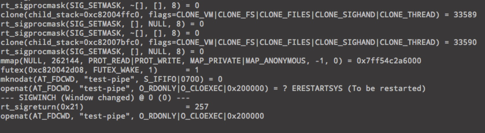

# golang群里go代码open fifo时不同内核下不同行为问题




```
skoo:
这代码我在 2.6.32 内核上，会阻塞，open 不返回
skoo:
3.10 内核上就ok。。。我现在不知道是内核有关，还是系统环境有关。
于鹏飞$golang实战群:
统计上来讲连续栈更快
skoo:
查man 手册，也没看到相关介绍。谁了解的。求指教。
樊冰心:
记得有个benchmark，说分段栈不稳定
Asta Xie:
@skoo@杭州-阿里 syscall应该都和内核有关啊
skoo:
这个理论上是常规操作，不知道如何可以正常工作。
skoo:
strace 可以看到 有个 ERESTRATSYS
 萧国翘:
man 7 fifo  @skoo@杭州-阿里 理论上命名管道要双端都调open才会返回。是不是你在另一内核上已经有w的open了
skoo:
没有的，就是这段代码。。。
skoo:
直接编译运行
skoo:
我可能知道了。。
我:
RDONLY
skoo:
应该是与 open 那个 01000000 的参数有关，可能这个是 non blocking 的意思在 高内核上，但 go 并没实现这个标志。。。
神仙:
open应该不阻塞吧
神仙:
读写才会？
skoo:
fifo
skoo:
应该是这个意思，只是这哥们写了个常量这里，就不认识了。
skoo:
常量就没有可移植性了
我:
0x200000 
我:
@skoo@杭州-阿里 Linux 2.6.39 introduced O_PATH open mode
我:
= =
我:
010000000 -> 0x200000 

Asta Xie:

神仙:
干嘛用的
我:
which (roughly speaking) doesn't really open the file at all (i.e. doesn't create an open file description), but just gives a file descriptor that's a handle to the unopened target. Its main use is as an argument to the *at functions (openat, etc.)


       First, openat() allows an application to avoid race conditions that could occur when using open(2) to open files in directories other than the current working directory.  These race conditions result from the fact that some
       component  of  the  directory  prefix  given  to open(2) could be changed in parallel with the call to open(2).  Such races can be avoided by opening a file descriptor for the target directory, and then specifying that file
       descriptor as the dirfd argument of openat().

       Second, openat() allows the implementation of a per-thread "current working directory", via file descriptor(s) maintained by the application.  (This functionality can  also  be  obtained  by  tricks  based  on  the  use  of
       /proc/self/fd/dirfd, but less efficiently.)

skoo:
soga，原来是这样的。。。
神仙:
所以是go的兼容性问题？
skoo:
不是吧。。。低内核就是不支持这特性了。。。
我:
看manual里说fifo RDONLY方式打开是可以的，不用等write end。
我:
但 加上一个当前内核不支持的参数的话。
神仙:
那是阻塞在syscall还是线程
我:
好像说错了，要 NONBLOCK + RDONLY 才能返回。
 萧国翘:
       The kernel maintains exactly one pipe object for each FIFO special file that is opened by at least one process.  The FIFO must be opened on both ends (reading and writing) before data can be passed.  Normally, opening the
       FIFO blocks until the other end is opened also.

       A process can open a FIFO in nonblocking mode.  In this case, opening for read-only will succeed even if no-one has opened on the write side yet, opening for write-only will fail with ENXIO (no  such  device  or  address)
       unless the other end has already been opened.
我:
所以前面内核3版本应该是O_PATH flag生效了。
 萧国翘:
asm-generic/fcntl.h
84:#define O_PATH               010000000

这玩意没用过，谁说说
我:
@xiaost@bj-今日头条 往前翻2页看看。
 萧国翘:
- - 哦，那段东西就是O_PATH的
我:
“为啥 O_PATH 不会真正打开一个文件，看到这里大家就明白了吧，这里的代码很简单，一切尽在不言中了。当从 finish_open 返回时，file 结构体几乎就是空的，只有 file.f_path 成员指向了这个文件，就连 f_op 都是空的。这或许就是 O_PATH 使用说明中一开始阐述的那两个目的具体表现吧。”

不清楚这样的fd怎么使用...

我:
Obtain a file descriptor that can be used for two purposes: to indicate a location in the filesystem tree and to perform operations that act purely at the file descriptor level. The file itself is not opened, and other file operations (e.g., read(2), write(2), fchmod(2), fchown(2), fgetxattr(2), mmap(2)) fail with the error EBADF.

= = 囧。
我:
@skoo@杭州-阿里 
```


```golang
var perm os.FileMode = 0700
if err := syscall.Mkfifo("test-pipe", uint32(perm&os.ModePerm)); err != nil {
    panic(err)
}
if _, err := os.OpenFile("test-pipe", 010000000, 0); err != nil {
    panic(err)
}
```

```
openat(AT_FDCMD, "test-pipe", O_RDONLY|O_CLOSEXEC|0x200000) = ? ERESTRATSYS (To be restarted)
```

```
       A  FIFO  special  file  (a named pipe) is similar to a pipe, except that it is accessed as part of the file system.  It can be opened by multiple processes for reading or writing.  When processes are exchanging data via the
       FIFO, the kernel passes all data internally without writing it to the file system.  Thus, the FIFO special file has no contents on the file system; the file system entry merely serves as a reference point so that  processes
       can access the pipe using a name in the file system.

       The  kernel  maintains exactly one pipe object for each FIFO special file that is opened by at least one process.  The FIFO must be opened on both ends (reading and writing) before data can be passed.  Normally, opening the
       FIFO blocks until the other end is opened also.

       A process can open a FIFO in nonblocking mode.  In this case, opening for read-only will succeed even if no-one has opened on the write side yet, opening for write-only will fail with  ENXIO  (no  such  device  or  address)
       unless the other end has already been opened.
```

