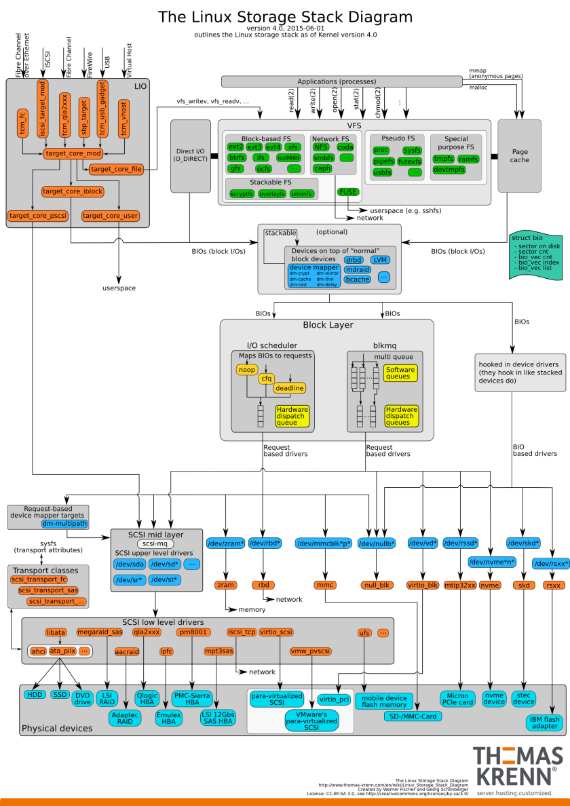
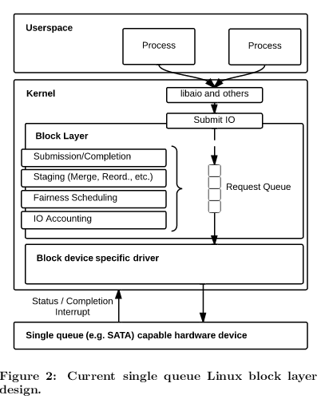
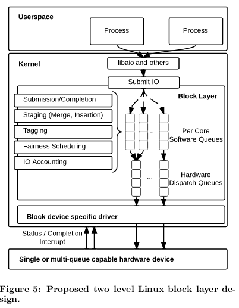

# （linux） io scheduler


## 概念

主要是因为高速内存和低速存储设备之间的... -> 有限的队列，一些改善性的操作： merge、reorder...

```
I/O schedulers are primarily useful for slower storage devices with limited queueing (e.g, single mechanical hard drives) — the purpose of an I/O scheduler is to reorder I/O requests to get more important ones serviced earlier. For a device with a very large internal queue, and very fast service (like a PCIe SSD!), an I/O scheduler won't do you any good; you're better off just submitting all requests to the device immediately.
```





### 几个概念


* IO请求重排序

* IO请求合并

  ```
  调度器的框架会自己去做后端合并(ELEVATOR_BACK_MERGE)，
  你选任何一种调度器后端合并都是逃不掉的。参考代码:
  block/elevator.c 
  ```

  ​


## 几种schedulers

ref：

* [archlinux wiki - Improving_performance#Tuning_IO_schedulers](https://wiki.archlinux.org/index.php/Improving_performance#Tuning_IO_schedulers)
* [磁盘IO调度算法](http://www.cnblogs.com/kongzhongqijing/articles/5786002.html) or [local](resource/磁盘IO调度算法 - milkty - 博客园.htm)
* [linux的IO调度](http://liwei.life/2016/03/14/linux_io_scheduler/) or [local](resource/Linux的IO调度 – 穷佐罗的Linux书.htm)
* [io调度器noop与deadline源码级分析](http://tieba.baidu.com/p/2767146878) or [local](resource/[原创]io调度器noop与deadline源码级分析_linux吧_百度贴吧.htm)


列出如下：


* 电梯算法（elevator）

  > 因为太简单了接近于什么都不做，所以又叫 `NOOP`（no operation）

  * 特点： 
    * 简单
    * 纯FIFO，都不对IO做排序，自然也就没有顺序扇区读取优化了。 因此所以适合闪存/SSD/RAM等随机访问设备
    * 利于写饿死读，因为写请求可以通过FS cache来buf而且可以合并后发到IO队列，而（无cache的）读请求只能等到前面的请求都完成才执行

* deadline算法

  * 特点： 
    * 比较简单
    * （读写分别）两个队列（正常和超时），尽量保证按扇区顺序读取（提高吞吐量）的情况下保证最大延时。 因此适合IO latency敏感性服务如数据库等（ssd出现之前）

* AS预料算法（anticipate）


* 特点

    * 基于deadline算法
    * 在最后一次读操作后,要等待6ms,才能继续进行对其它I/O请求进行调度。 目的是尽量合并小的写请求，用写延时换写吞吐。 因此适用于写入较多且延时不敏感的服务如文件服务等，不适合延时敏感服务如数据库等
    * 效果不好，已经被删除（惨惨惨）

* 完全公平排队算法（CFQ）


* 特点

    * 新版本linux内核默认调度算法
    * 支持IO优先级、支持cgroup
    * 分进程队列 + 全局异步IO队列
    * 在所有进程间尽量公平，避免饿死尽量低延迟，是deadline和as的折中
    * 不适合IO压力在少数进程的情况如数据库等，适合多媒体服务/桌面系统等


> 还一种说法是： linux里把 IO调度算法`本身` 叫做 电梯算法，所以就有 elevator=deadline 这样的启动配置


## linux io调度性能优化/调整


ref：

* [Performance Tuning on Linux — Disk I/O](http://cromwell-intl.com/linux/performance-tuning/disks.html) or [local](resource/Disk I_O _ Performance Tuning on Linux.html)

  提及了：

  * 几种算法的讲解


  * 几种算法的参数解释和调参建议

    * CFQ

      * fifo_expire_async
      * fifo_expire_sync
      * low_latency
      * quantum
      * slice_idle

    * deadline

      * fifo_batch
      * read_expire
      * write_expire
      * writes_starved

    * NOOP

      > 优化个毛线...

  * 一般的块设备IO参数解释和调参建议（估计指的磁盘吧）

    * max_sectors_kb
    * nr_requests
    * optimal_io_size
    * read_ahead_kb
    * retational

  * vmm相关的调参建议（改善IO）

    * vm.dirty_ratio
    * vm.dirty_background_ratio
    * vm.vfs_cache_pressure


## blk-mq: multiqueue block layer subsystem 

ref: 

* [ORACLE UEK 4 : Where is my I/O scheduler ? None ?  - Multi-queue model blk-mq](https://mahmoudhatem.wordpress.com/2016/02/08/oracle-uek-4-where-is-my-io-scheduler-none-multi-queue-model-blk-mq/)
* [reddit - What I/O scheduler to use for SATA SSD? NVMe SSD?](https://www.reddit.com/r/archlinux/comments/5rkx6k/what_io_scheduler_to_use_for_sata_ssd_nvme_ssd/)


文中也给了几个ref：

* [lwn - The multiqueue block layer](https://lwn.net/Articles/552904/)
* [pdf - Linux Block IO: Introducing Multi-queue SSD Access on Multi-core Systems](http://kernel.dk/systor13-final18.pdf)
* [pdf - Improving Block-level Efficiency with scsi-mq](https://arxiv.org/pdf/1504.07481.pdf)








目前的io scheduler算法都是针对老的单队列模型，新的多队列模型的调度算法还在研究中（如mq-deadline等）。


此外，ref里还提到，blk-mq目前是全局的，而hdd还是需要传统的调度算法的，所以：

```
Stop using the old I/O scheudlers, start using blk_mq!

----

if you don't have any normal hdds
wait a bit for it to be fixed so it can be chosen per drive and combined with an io scheduler
```


# 摘录： [OS中常用的调度算法总结](http://blog.chinaunix.net/uid-25132162-id-361291.html) 

**一、常见的批处理作业调度算法**

1.**先来先服务调度算法（FCFS）**:就是按照各个作业进入系统的自然次序来调度作业。这种调度算法的优点是实现简单，公平。其缺点是没有考虑到系统中各种资源的综合使用情况，往往使短作业的用户不满意，因为短作业等待处理的时间可能比实际运行时间长得多。

2.**短作业优先调度算法****(SPF):** 就是优先调度并处理短作业，所谓短是指作业的运行时间短。而在作业未投入运行时，并不能知道它实际的运行时间的长短，因此需要用户在提交作业时同时提交作业运行时间的估计值。 

3.**最高响应比优先算法(HRN)：**FCFS可能造成短作业用户不满，SPF可能使得长作业用户不满，于是提出HRN，选择响应比最高的作业运行。响应比=1+作业等待时间/作业处理时间。

4. **基于优先数调度算法(HPF)：**每一个作业规定一个表示该作业优先级别的整数，当需要将新的作业由输入井调入内存处理时，优先选择优先数最高的作业。

5.**均衡调度算法，即****多级队列调度算法**

基本概念：

   作业周转时间（Ti）＝完成时间(Tei)－提交时间(Tsi)

   作业平均周转时间(T)＝周转时间/作业个数

   作业带权周转时间（Wi）＝周转时间/运行时间

   响应比＝（等待时间＋运行时间）/运行时间

**二、进程调度算法**

1.**先进先出算法(FIFO)：**按照进程进入就绪队列的先后次序来选择。即每当进入进程调度，总是把就绪队列的队首进程投入运行。

2. **时间片轮转算法(RR)：**分时系统的一种调度算法。轮转的基本思想是，将CPU的处理时间划分成一个个的时间片，就绪队列中的进程轮流运行一个时间片。当时间片结束时，就强迫进程让出CPU，该进程进入就绪队列，等待下一次调度，同时，进程调度又去选择就绪队列中的一个进程，分配给它一个时间片，以投入运行。

3.** 最高优先级算法(HPF)：**进程调度每次将处理机分配给具有最高优先级的就绪进程。最高优先级算法可与不同的CPU方式结合形成可抢占式最高优先级算法和不可抢占式最高优先级算法。

4. **多级队列反馈法：**几种调度算法的结合形式多级队列方式。

**三、空闲分区分配算法**

**1. 首先适应算法：**当接到内存申请时，查找分区说明表，找到第一个满足申请长度的空闲区，将其分割并分配。此算法简单，可以快速做出分配决定。

2. **最佳适应算法：**当接到内存申请时，查找分区说明表，找到第一个能满足申请长度的最小空闲区，将其进行分割并分配。此算法最节约空间，因为它尽量不分割到大的空闲区，其缺点是可能会形成很多很小的空闲分区，称为“碎片”。

3. **最坏适应算法：**当接到内存申请时，查找分区说明表，找到能满足申请要求的最大的空闲区。该算法的优点是避免形成碎片，而缺点是分割了大的空闲区后，在遇到较大的程序申请内存时，无法满足的可能性较大。

**四、虚拟页式存储管理中的页面置换算法**

1.**理想页面置换算法(OPT)：**这是一种理想的算法，在实际中不可能实现。该算法的思想是：发生缺页时，选择以后永不使用或在最长时间内不再被访问的内存页面予以淘汰。

2.**先进先出页面置换算法(FIFO)：**选择最先进入内存的页面予以淘汰。

3. **最近最久未使用算法（LRU）：**选择在最近一段时间内最久没有使用过的页，把它淘汰。

**4.最少使用算法（LFU）：**选择到当前时间为止被访问次数最少的页转换。

五、**磁盘调度**

**1.先来先服务（FCFS）：**是按请求访问者的先后次序启动磁盘驱动器，而不考虑它们要访问的物理位置

**2.最短寻道时间优先（SSTF）：让离当前磁道最近的请求访问者启动磁盘驱动器，**即是让查找时间最短的那个作业先执行，而不考虑请求访问者到来的先后次序，这样就克服了先来先服务调度算法中磁臂移动过大的问题

**3.扫描算法（SCAN）或电梯调度算法：**总是从磁臂当前位置开始，沿磁臂的移动方向去选择离当前磁臂最近的那个柱面的访问者。如果沿磁臂的方向无请求访问时，就改变磁臂的移动方向。在这种调度方法下磁臂的移动类似于电梯的调度，所以它也称为电梯调度算法。

**4.循环扫描算法（CSCAN）：**循环扫描调度算法是在扫描算法的基础上改进的。磁臂改为单项移动，由外向里。当前位置开始沿磁臂的移动方向去选择离当前磁臂最近的哪个柱面的访问者。如果沿磁臂的方向无请求访问时，再回到最外，访问柱面号最小的作业请求。


