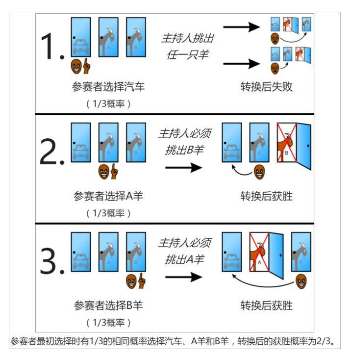

比如，著名的三门问题。


你参加一个节目，很幸运获得台上抽奖的机会。台上有A、B、C三个道具门。


一辆最新款的特斯拉就在一扇门后，另外2扇门后面是山羊。猜对了特斯拉在的那扇门，你就直接可以开走特斯拉。但是如何选择的门后面是山羊，你只能骑着山羊回家了。


从三扇门里选择1扇门，中奖的概率是三分之一，你选择了B扇门。


这时，主持人打开另外两扇门中的一扇，发现后面是山羊。


这时候只剩下两扇门，主持人额外送了你一次改变的机会，问你是坚持刚才的选择，还是换另一扇门。你会选择换吗？


统计显示，大部分人会选择不换。理由是，现在只有两扇门了，特斯拉在每扇门后的概率应该是二分之一，既然选什么都一样，还是相信直觉，坚持第一选择。


恭喜大部分人，你们都错了。正确的答案是：换。


不换，相当于3个门里选1个，概率是三分之一。如果选择换门，相当于3扇门里选择2扇门，概率是三分之二。所以，选择换门，得奖概率提高一倍。具体概率推理如下图：





# 理解


囧，穷举法确实靠谱。。。

`这时，主持人打开另外两扇门中的一扇，发现后面是山羊` 这个描述有比较明确的**碰巧**的意味，所以能看作是后验概率： `主持人打开（剩下的两扇门中的）一扇门发现是🐑时，参赛者打开的是🚗的概率`。

把主持人选中🐑的概率记为 $P_S$ ，而参赛者选中🐑的概率记为 $P_s$ ，参赛者选中🚘的概率记为 $P_c$，

> $P_🐑$ 也挺有意思的，$P_🚗$ 

$$
P_S = P_{Ss} + P_{Sc} = P_{S|c}*P_c + P_{S|s}*P_s = 1*1/3+1/2*2/3 = 2/3
$$

我们要求的后验概率则可记为：
$$
P_{c|S} = \frac{P_{Sc}} {P_S} = \frac{P_{S|c}*P_c} {P_S} = \frac{1*1/3}{2/3} = 1/2
$$


$$
P_{s|S} = \frac{P_{Ss}}{P_S} = 1/2
$$

所以此时预期 $P_c$ 为 1/2，也即 **换不换还是一样**。

## 问题： 主持人是否知道门后内容，也即主持人是“碰巧”打开🐑还是故意打开🐑


https://baike.baidu.com/item/%E4%B8%89%E9%97%A8%E9%97%AE%E9%A2%98/1242689?fr=aladdin

```
三门问题（Monty Hall problem）亦称为蒙提霍尔问题、蒙特霍问题或蒙提霍尔悖论，大致出自美国的电视游戏节目Let's Make a Deal。问题名字来自该节目的主持人蒙提·霍尔（Monty Hall）。参赛者会看见三扇关闭了的门，其中一扇的后面有一辆汽车，选中后面有车的那扇门可赢得该汽车，另外两扇门后面则各藏有一只山羊。当参赛者选定了一扇门，但未去开启它的时候，节目主持人开启剩下两扇门的其中一扇，露出其中一只山羊。主持人其后会问参赛者要不要换另一扇仍然关上的门。问题是：换另一扇门会否增加参赛者赢得汽车的机率？如果严格按照上述的条件，即主持人清楚地知道，自己打开的那扇门后是羊，那么答案是会。不换门的话，赢得汽车的几率是1/3。换门的话，赢得汽车的几率是2/3。
```

主持人清楚地知道自己打开的那扇门后是羊 意味着打开🐑门这个操作是个**有意选择**而不是**概率选择**，那么：

$$
P_S = 1
$$

$$
P_{c|S} = \frac{P_{Sc}} {P_S} = \frac{P_{S|c}*P_c} {P_S} = \frac{1*1/3}{1} = 1/3
$$

那么，自然是**换更好了**


其实，可以简化理解为：

1/3 -> 🚗
2/3 -> 🐑


### 《五分钟商学院》里的表述问题

《五分钟商学院》里，表述有些不一样，`主持人打开另外两扇门中的一扇，是空的`，这个表示，理解成`碰巧`或者是`故意`都可以，从这个例子来看作者的本意是后者。。 哎


