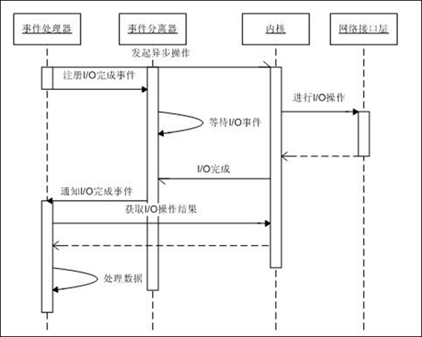

<!-- TOC depthFrom:1 depthTo:6 withLinks:1 updateOnSave:0 orderedList:0 -->

- [背景知识](#背景知识)
	- [用户空间和内核空间](#用户空间和内核空间)
	- [进程切换](#进程切换)
	- [缓存 I/O](#缓存-io)
	- [系统调用](#系统调用)
		- [系统调用函数？](#系统调用函数)
		- [vsyscall](#vsyscall)
- [IO模型](#io模型)
	- [同步IO](#同步io)
	- [reactor - IO多路复用](#reactor-io多路复用)
		- [windows](#windows)
		- [linux - select/epoll](#linux-selectepoll)
	- [proactor - 异步IO](#proactor-异步io)
		- [windows - IOCP](#windows-iocp)
		- [linux - aio](#linux-aio)
		- [模拟proactor](#模拟proactor)
	- [reactor VS proactor](#reactor-vs-proactor)
	- [其他 - 信号IO](#其他-信号io)
- [linux IO相关库函数/系统调用](#linux-io相关库函数系统调用)
	- [常规IO - BIO](#常规io-bio)
	- [IO多路复用](#io多路复用)
		- [select](#select)
		- [epoll](#epoll)
	- [异步IO](#异步io)
		- [aio](#aio)
	- [fcntl](#fcntl)
	- [termios](#termios)
		- [stty命令](#stty命令)
	- [ioctl](#ioctl)

<!-- /TOC -->

# 背景知识

## 用户空间和内核空间

```
现在操作系统都是采用虚拟存储器，那么对32位操作系统而言，它的寻址空间（虚拟存储空间）为4G（2的32次方）。
操作系统的核心是内核，独立于普通的应用程序，可以访问受保护的内存空间，也有访问底层硬件设备的所有权限。
为了保证用户进程不能直接操作内核（kernel），保证内核的安全，操心系统将虚拟空间划分为两部分，一部分为内核空间，一部分为用户空间。
针对linux操作系统而言，将最高的1G字节（从虚拟地址0xC0000000到0xFFFFFFFF），供内核使用，称为内核空间，而将较低的3G字节（从虚拟地址0x00000000到0xBFFFFFFF），供各个进程使用，称为用户空间。
```


## 进程切换

```
为了控制进程的执行，内核必须有能力挂起正在CPU上运行的进程，并恢复以前挂起的某个进程的执行。这种行为被称为进程切换。因此可以说，任何进程都是在操作系统内核的支持下运行的，是与内核紧密相关的。

从一个进程的运行转到另一个进程上运行，这个过程中经过下面这些变化：
1. 保存处理机上下文，包括程序计数器和其他寄存器。
2. 更新PCB信息。
3. 把进程的PCB移入相应的队列，如就绪、在某事件阻塞等队列。
4. 选择另一个进程执行，并更新其PCB。
5. 更新内存管理的数据结构。
6. 恢复处理机上下文。
```


## 缓存 I/O
```
缓存 I/O 又被称作标准 I/O，大多数文件系统的默认 I/O 操作都是缓存 I/O。
在 Linux 的缓存 I/O 机制中，操作系统会将 I/O 的数据缓存在文件系统的页缓存（ page cache ）中。
也就是说，数据会先被拷贝到操作系统内核的缓冲区中，然后才会从操作系统内核的缓冲区拷贝到应用程序的地址空间。

缓存 I/O 的缺点：
数据在传输过程中需要在应用程序地址空间和内核进行多次数据拷贝操作，这些数据拷贝操作所带来的 CPU 以及内存开销是非常大的。
```

## 系统调用
```
系统调用（System Call）是操作系统为在用户态运行的进程与硬件设备（如CPU、磁盘、打印机等）进行交互提供的一组接口。
当用户进程需要发生系统调用时，CPU 通过软中断切换到内核态开始执行内核系统调用函数。
```


### 系统调用函数？
注意前面定义中提到的“接口”二字，在OOP乃至其他CS领域，接口都代表着“约定”，而不是“实现”。
所以： **实际上kernel并不提供`系统调用函数`，而是提供`系统调用接口`，也即 压栈（寄存器使用）的约定**
可以这么理解： `ssize_t read(int fd, void *buf, size_t count)`是glibc提供的函数，实现了访问 `read` 系统调用接口的功能，也即一个wrapper，实际上glibc对大多数系统调用都提供了这样的wapper： 众多的`系统调用函数`。 甚至还提供`int syscall(int number, ...)`来允许使用者自行访问特殊系统调用。

> 我曾经有过的一个疑问： glibc函数是通过glibc库链接的，那`系统调用函数`呢？

### vsyscall
前一节主要是为了强调 `接口`，刻意说明了内核没有提供“系统调用函数”。 但其实对于x86_64架构，linux通过`vdso`的方式提供了`vsyscall`**函数**来实现系统调用。
这种新方式因为不需要引起中断，所以性能（开销）会好不少。


# IO模型

## 同步IO
略过介绍。


## reactor - IO多路复用


**思路**
把IO操作（read、write）和（检测）IO-ready操作（select/poll/epoll）分开，只有当IO-ready时才进行对应的IO操作，使得IO操作本身不阻塞，而select等会阻塞。

select/poll操作： 同步 & 阻塞
read/write操作： 同步 & 非阻塞

### windows
select功能较局限，一般用IOCP。

### linux - select/epoll

**等待通知的方式**
* `epoll_wait`

## proactor - 异步IO

> 图有些问题，proactor中数据被内核复制到（用户态内存）缓冲区，业务线程无需再（陷入内核态）再从内核赋值数据。

**思路**
把buf和操作提交给内核，并且告知通知（IO-done）的方式，内核完成对应IO操作后以对应方式通知程序。
根据通知方式的不同，会有一些流程上的差异。
通知方式有： 不通知（程序主动check）、信号通知、函数回调 这三种。

操作： 异步

### windows - IOCP
不熟悉，略过。 = =

### linux - aio

**等待通知的方式**
* `while` + `aio_error,aio_return`
* `aio_suspend` ≈ `epoll_wait`
* `callback`
* `epoll` + `eventfd` + `callback`

**存在的问题**
* AIO路径的资源竞争问题
> AIO可能阻塞在资源的请求上如内存，请求队列slot，inode semaphore
* AIO读写操作的调度序列
> 设计问题类似于目前流行的系统架构方案的权衡，目标是并发最大化，延迟最小化，但每个AIO读写操作到底优先选择何种方式进行，在请求队列中是按FIFO，优先级队列还是根据现在POSIX标准读请求优于写请求。由于目前的内核AIO方案仍然是有阻塞的，无法在有阻塞的情况下选择更好的调度方案，更好的是去做一些经验性的临时考虑。

### 模拟proactor
可以发现proactor区别reactor主要在于“前摄”，可以在reactor基础上用单独线程（多路复用 + 线程）来完成“前摄”活动以模拟proactor。

> 有一些框架的proactor就是这样实现的，没有使用libaio
> 实际上linux下（现有实现）的 Sync IO = aio + block，在内核部分是async的

## reactor VS proactor
顾名思义，前摄更强调 “前一活动”的影响，也即IO处理流程中的前面部分OS承担更多，也更“主动”。
简而言之，`reactor只告诉业务线程IO就绪； 而proactor则告诉业务线程IO完成`

（以下的“io”如果和select/accept并列出现时，只表示io读写）
从真正的业务来看，IO本身不算业务，所以reactor中可能会有 selector（boss）线程 和 io（worker）线程两种角色，当然在真正处理业务逻辑的线程眼里两者都是IO线程。

**把selector和io分离在不同线程的好处**：
1. reactor模式下io虽然是非阻塞的，但同样会陷入内核态，造成线程切换；
2. 而io本身可能有一些数据装包的过程，有一定的cpu消耗。

这两者都影响accept的及时性。

proactor模式中，因为数据直接由内核复制到用户缓冲区，所以上面第一点就没有了（减少了大量的上下文切换），但第二点还是在的，也可以用多个io线程来处理数据的拼装、反序列化等（如果有的话）。

综上所述，一般的io多路复用可以认为是reactor模式； 而真正的异步io（aio、iopc）才是proactor模式。

## 其他 - 信号IO
O_ASYNC + SIGIO方式。
`这个方案就不说了，除了实时外没啥优点，信号机制在操作系统中本来就是个被过度设计的典范。信号IO不仅在大量IO操作时可能会因为信号队列溢出导致没法通知，还有糟糕的性能也使得这东西没法用。`


# linux IO相关库函数/系统调用

## 常规IO - BIO
```c
#include <unistd.h>

ssize_t pread(int fildes, void *buf, size_t nbyte, off_t offset);
ssize_t read(int fildes, void *buf, size_t nbyte);

ssize_t pwrite(int fildes, const void *buf, size_t nbyte,
       off_t offset);
ssize_t write(int fildes, const void *buf, size_t nbyte);
```

***code*** [bio_example](code/bio_example.c)

## IO多路复用

### select

```c
/* According to POSIX.1-2001 */
#include <sys/select.h>

/* According to earlier standards */
#include <sys/time.h>
#include <sys/types.h>
#include <unistd.h>

int select(int nfds, fd_set *readfds, fd_set *writefds,
           fd_set *exceptfds, struct timeval *timeout);

void FD_CLR(int fd, fd_set *set);
int  FD_ISSET(int fd, fd_set *set);
void FD_SET(int fd, fd_set *set);
void FD_ZERO(fd_set *set);

#include <sys/select.h>

int pselect(int nfds, fd_set *readfds, fd_set *writefds,
            fd_set *exceptfds, const struct timespec *timeout,
            const sigset_t *sigmask);
```

**思路**
* 有检测事件发生时select返回；
* 使用者维护fd_set（bitmap）（传给kernel）记录事件，fd作为bitmap index
* select返回后 `逐个fd & fd_set` 来检查是否被置位（有事件）；

**优点**
* （相对于BIO）一个线程可能同时处理多个fd
* 支持regular file

**缺点**
* 最大fd限制
> 最大fd为1023，注意是最大fd，不是最大fd数。 当fd大于1023时，该fd不能用于select
* 性能随连接数的增加而线性下降
* 内存使用： 不同的时间需要不同的fd_set，每次使用需要清空

***code*** [select_example](code/select_example.c)

### epoll
```c
#include <sys/epoll.h>

int epoll_create(int size);
int epoll_create1(int flags);

int epoll_ctl(int epfd, int op, int fd, struct epoll_event *event);

int epoll_wait(int epfd, struct epoll_event *events,
               int maxevents, int timeout);
int epoll_pwait(int epfd, struct epoll_event *events,
               int maxevents, int timeout,
               const sigset_t *sigmask);
```

**思路**
* 内核维护监听的fd；
* 每个fd关联的epoll_event可以指定监听事件类型；
* epoll_wait返回事件数目，根据该值遍历事件处理；

**优点**
* 连接数增加性能无明显降低；
* pollable对象范围扩大，新引入了 signalfd、timerfd、eventfd 等；
* 使用（相对aio）简单；

**缺点**
* regular file is not pollable
* read仍然需要执行syscall完成数据从内核空间到用户空间的复制

***code*** [epoll_example](code/epoll_example.c)

## 异步IO

### aio
```c
#include <aio.h>

int aio_read(struct aiocb *aiocbp);

int aio_write(struct aiocb *aiocbp);

int aio_error(const struct aiocb *aiocbp);

size_t aio_return(struct aiocb *aiocbp);

int aio_suspend(const struct aiocb * const aiocb_list[],
                int nitems, const struct timespec *timeout);

int aio_cancel(int fd, struct aiocb *aiocbp);

int aio_fsync(int op, struct aiocb *aiocbp);

int lio_listio(int mode, struct aiocb *const aiocb_list[],
               int nitems, struct sigevent *sevp);
```

**思路**
* 初始化aiocb结构体，指定buf、fd、通知方式
* 提交操作（read、write）
* 根据通知处理buf中数据

***code***
[aio_example_1](code/aio_example_1.c)
[aio_example_2](code/aio_example_2.c)
[aio_example_3](code/aio_example_3.c)
[aio_example_4](code/aio_example_4.c)

**优点**
* 高性能
* 可以处理regular file，常用作epoll（对普通文件）的补充（虽然本意并不是这样）

**缺点**
* linux aio实现缺陷
* 使用相对复杂

## fcntl
```c
#include <unistd.h>
#include <fcntl.h>

int fcntl(int fd, int cmd, ... /* arg */ );
```

文件的一些“控制”操作 - cmd参数指定：
* F_GETFD 获取文件描述符flags
* F_SETFD 设置文件描述符flags
* F_GETFL 获取文件状态flags
* F_SETFL 设置文件状态flags
* F_DUPFD 复制一份fd，得到指向同一个打开文件的新fd
* F_DUPFD_CLOEXE 等于原子性的： F_DUPFD + F_SETFD(FD_CLOEXE)
...

文件状态flags
* 文件访问模式
  * O_RDONLY
  * O_WRONLY
  * O_RDWR
* 文件创建flags
  * O_CREAT
  * O_EXCL
  * O_NOCTTY
  * O_TRUNC
* 其他
  * O_APPEND
  * O_ASYNC
  * O_DIRECT
  * O_NOATIME
  * O_NOBLOCK


## termios

```c
#include <termios.h>
#include <unistd.h>

int tcgetattr(int fd, struct termios *termios_p);

int tcsetattr(int fd, int optional_actions,
              const struct termios *termios_p);

int tcsendbreak(int fd, int duration);

int tcdrain(int fd);

int tcflush(int fd, int queue_selector);

int tcflow(int fd, int action);

void cfmakeraw(struct termios *termios_p);

speed_t cfgetispeed(const struct termios *termios_p);

speed_t cfgetospeed(const struct termios *termios_p);

int cfsetispeed(struct termios *termios_p, speed_t speed);

int cfsetospeed(struct termios *termios_p, speed_t speed);

int cfsetspeed(struct termios *termios_p, speed_t speed);
```

获取/设置/控制 终端设备的属性、行为。


### stty命令

```shell
# root @ localhost in ~ [17:31:33] tty:pts/0 L:1 N:20
$ stty --all
speed 38400 baud; rows 65; columns 236; line = 0;
intr = ^C; quit = ^\; erase = ^?; kill = ^U; eof = ^D; eol = <undef>; eol2 = <undef>; swtch = <undef>; start = ^Q; stop = ^S; susp = ^Z; rprnt = ^R; werase = ^W; lnext = ^V; flush = ^O; min = 1; time = 0;
-parenb -parodd -cmspar cs8 -hupcl -cstopb cread -clocal -crtscts
-ignbrk -brkint -ignpar -parmrk -inpck -istrip -inlcr -igncr icrnl ixon -ixoff -iuclc -ixany -imaxbel -iutf8
opost -olcuc -ocrnl onlcr -onocr -onlret -ofill -ofdel nl0 cr0 tab0 bs0 vt0 ff0
isig icanon iexten echo echoe echok -echonl -noflsh -xcase -tostop -echoprt echoctl echoke

# root @ localhost in ~ [17:31:46] tty:pts/0 L:1 N:21
$ stty      
speed 38400 baud; line = 0;
-brkint -imaxbel

# root @ localhost in ~ [17:31:49] tty:pts/0 L:1 N:22
$ tty
/dev/pts/0
```

`icrnl`: `Input: convert CR to NL`
`onlcr`: `Output: add to NL a CR`

## ioctl

```c
#include <sys/ioctl.h>

int ioctl(int d, int request, ...);
```

操作特殊文件的设备参数，尤其是字符文件。
